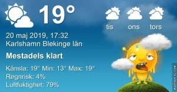

Idag går solen upp 04:39 och ned 21:17 Dagens längd är 16 timmar och 38 minuter. Det är gryning 03:46 och skymning 22:10 Det är dagsljus 18 timmar och 24 minuter. Månen går upp 23:07 och ned 05:48 Månen är belyst 99 %

 Molnigt 13,8 C  Vindby 1,2 m/s E  Luftfuktighet 98 %  hPa 1004 Kl.02:20

 Molnigt 15,1 C  Vindby 1 m/s S  Luftfuktighet 96 %  hPa 1003 Kl.07:30

 Halvklart 27,9 C  Vindby 3 m/s ESE  Luftfuktighet 59 %  hPa 1004 Kl.13:30

 Molnigt 21,8 C  Vindby 0,8 m/s E  Luftfuktighet 68 %  hPa 1002 Kl.19:50

 Alldeles för varmt!

Högst och lägst uppmätta temperatur igår (inofficiellt privat mätare) Max 29,5 ( i solen ) , Min 11,9 C Högst uppmätta vind 2,7 m/s, Högst uppmätta vindby 4 m/s

Högst och lägst uppmätta temperatur igår (officiellt enligt [YR.NO](http://www.vackertvader.se/v%C3%A4derstation/karlshamn?utm_source=email&utm_medium=email&utm_campaign=asarum)) Max 21 C, Min 12,8 C Högst uppmätta vind 3,4 m/s. Högst uppmätta vindby 8,3 m/s

 

## _Barstow och Baker Nevada_

\[gallery type="rectangular" link="file" size="large" ids="28922,28923,28924,28925,28926,28927,28928,28929,28930,28931,28932,28933,28934,28935,28936,28937,28938,28939,28921,28920,28940"\]

Efter en skön natts sömn var det dags att åka vidare mot Las Vegas. På vägen stannade vi i Barstow där det fanns ett gigantiskt stort köpcenter mitt ute i öknen. Här tillbringade vi två och en halv timme i hopp om att vi skulle göra av med så mycket pengar som möjligt. På alla sådana här bussresor finns det en sponsor för att turerna inte ska bli för dyra och det här var vår sponsor den här gången. Det är bara att stå ut och vänta på att vi ska åka vidare för sånt här är inget för mig när det är så dyrt och bara märkesprodukter. Vi åt lite mat och gick och tittade på öknen runt omkring och sen var det dags att åka vidare. Vi stannade till en kort stund på vägen för att titta på sköldpaddor och sen var nästa stopp i Baker där världens högsta termometer står. Där var det varmt, den visade på 38 grader i skuggan! Det märktes att vi närmade oss Las Vegas! [Här](https://en.wikipedia.org/wiki/World%27s_tallest_thermometer) kan du läsa mer om termometern.
