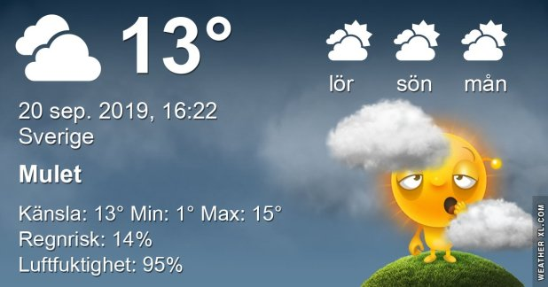

## Fredag 20 September

I dag gryr dagen i Asarum 06:03. Solen går upp klockan 06:41 och ner klockan 19:06 . Det mörknar vid 19:43. Dagens längd är 12 timmar och 25 minuter. Det är dagsljus 13 timmar och 40 minuter. Månen går upp 21:47 och ned 13:23 Månen är belyst 71 %

I Asarum blir dagen 4 minuter och 40 sekunder kortare. Dagen har blivit 5 timmar och 15 minuter kortare sedan sommarsolståndet. Vintersolstånd om 93 dagar.

Missa inte gyllene timmen som börjar klockan 18:19 i Asarum. Då står solen lågt och kastar ett fint gyllene ljus

 

 Växlande molnighet 0,6 C  Vindstilla  Luftfuktighet 94 %  hPa 1021 Kl.02:20

 Mest molnigt 2,3 C  Vindstilla  Luftfuktighet 99 %  hPa 1019 Kl.07:00

 Molnigt 14,4 C  Vindby 2 m/s N  Luftfuktighet 88 %  hPa 1017 Kl.14:20

 Molnigt 11,8 C  Vindby 1,8 m/s NE  Luftfuktighet 92 %  hPa 1016 Kl.20:05

Usch vad trött jag är! Kallt och mörkt och trist! Aldrig är man nöjd 😉

Högst och lägst uppmätta temperatur igår (inofficiellt privat mätare) Max 20,1 , Min - 0,6 C Högst uppmätta vind 2,7 m/s, Högst uppmätta vindby 4,4 m/s

Högst och lägst uppmätta temperatur igår (officiellt enligt [YR.NO](http://www.vackertvader.se/v%C3%A4derstation/karlshamn?utm_source=email&utm_medium=email&utm_campaign=asarum)) Max 15,4 C, Min 1,1 C Högst uppmätta vind 4,6 m/s. Högst uppmätta vindby 10,6 m/s

## _**Några ordspråk får bli dagens inlägg**_

\[gallery type="rectangular" link="file" size="large" ids="31892,31893,31894,31895,31896,31897,31898"\]
