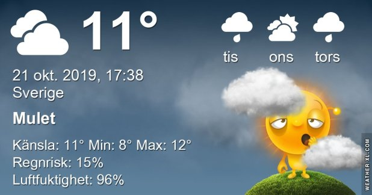

## Måndag 21 Oktober

I dag gryr dagen i Asarum 07:05. Solen går upp klockan 07:44 och ner klockan 17:46 . Det mörknar vid 18:24. Dagens längd är 10 timmar och 02 minuter. Det är dagsljus 11 timmar och 19 minuter. Månen går upp 23:13 och ned 15:26 Månen är belyst 56 %

I Asarum blir dagen 4 minuter och 34 sekunder kortare. Dagen har blivit 7 timmar och 38 minuter kortare sedan sommarsolståndet. Vintersolstånd om 62 dagar.

Missa inte gyllene timmen som börjar klockan 16:54 i Asarum. Då står solen lågt och kastar ett fint gyllene ljus

 Molnigt 9 C  Vindstilla  Luftfuktighet 95 %  hPa 1011 Kl.01:45

 Mest molnigt 7,8 C  Vindstilla  Luftfuktighet 97 %  hPa 1014 Kl.07:30

 Molnigt 12,8 C  Vindby 1 m/s N  Luftfuktighet 88 %  hPa 1015 Kl.15:30

 Molnigt 9,7 C  Vindby 1 m/s W  Luftfuktighet 92 %  hPa 1015 Kl.20:05

Mulet, grått och tröttväder!

Högst och lägst uppmätta temperatur igår (inofficiellt privat mätare) Max 16,4, Min 9,4 C Högst uppmätta vind 1,7 m/s, Högst uppmätta vindby 2,4 m/s

Högst och lägst uppmätta temperatur igår (officiellt enligt [YR.NO](http://www.vackertvader.se/v%C3%A4derstation/karlshamn?utm_source=email&utm_medium=email&utm_campaign=asarum)) Max 13,2 C, Min 9,3 C Högst uppmätta vind 1,8 m/s. Högst uppmätta vindby 4,4 m/s

## _**Den gamla eken**_

Eftersom den gamla eken verkar vara av intresse så kommer här lite fakta om den via den här skylten som sitter jämte trädet. Tyvärr hittar jag inte mer information om eken.

