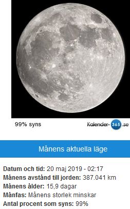
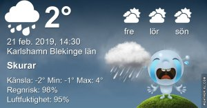

Idag går solen upp 07:13 och ned 17:16 Dagens längd är 10 timmar och 3 minuter. Det är gryning 06:35 och skymning 17:55 Det är dagsljus 11 timmar och 20 minuter. Månen går upp 19:59 och ned 08:18 Månen är belyst 97 %

 Lätt regn 2,1 C  Vindby 0,3 m/s NW  Luftfuktighet 89 %  hPa 1014  Regn 1,2 mm Kl.02:05

 Regn 2,3 C  Vindby 3 m/s WSW  Luftfuktighet 92 %  hPa 1012  Regn 8,2 mm Kl.07:50

 Regn och snöblask om vartannat 1,8 C  Vindby 2,8 m/s ENE  Luftfuktighet 86 %  hPa 1014  Regn 15,5 mm Kl.13:30

 Duggregn - 0,2 C  Vindby 2,6 m/s E  Luftfuktighet 87 %  hPa 1019  Regn 17,7 mm Kl.19:45

 Busväder hela dagen med regn och snöblask.

Högst och lägst uppmätta temperatur igår (inofficiellt privat mätare) Max 13,5 , Min 0 C Högst uppmätta vind 2,7 m/s, Högst uppmätta vindby 4,8 m/s

Högst och lägst uppmätta temperatur igår (officiellt enligt [YR.NO](http://www.vackertvader.se/v%C3%A4derstation/karlshamn?utm_source=email&utm_medium=email&utm_campaign=asarum)) Max 8,6 C, Min 0,7 C Högst uppmätta vind 2,8 m/s. Högst uppmätta vindby 9 m/s

\[gallery type="rectangular" link="file" size="large" ids="27385,27386,27387,27388,27389,27390,27391" orderby="rand"\]

Ett gäng blöta fåglar på besök idag.
