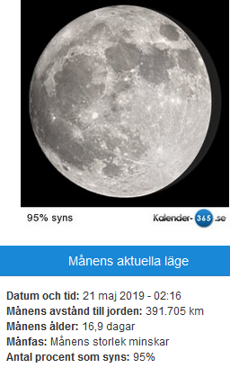
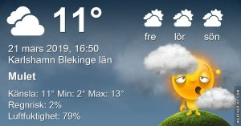

Idag går solen upp 06:01 och ned 18:16 Dagens längd är 12 timmar och 15 minuter. Det är gryning 05:24 och skymning 18:53 Det är dagsljus 13 timmar och 29 minuter. Månen går upp 18:511 och ned 06:37 Månen är belyst 100 %

 Växlande molnighet - 1,3 C  Vindstilla  Luftfuktighet 85 %  hPa 1023 Kl.02:20

 Molnigt 4,8 C  Vindby 1,8 m/s ENE  Luftfuktighet 90 %  hPa 1022 Kl.06:45

 Molnigt 13,7 C  Vindby 6,5 m/s N  Luftfuktighet 72 %  hPa 1020 Kl.14:50

 Molnigt 9,6 C  Vindby 2,6 m/s SE  Luftfuktighet 79 %  hPa 1021 Kl.19:55

 Grått väder men varmt och skönt med vårkänsla ändå!

Högst och lägst uppmätta temperatur igår (inofficiellt privat mätare) Max 9,4 , Min – 6,4 C Högst uppmätta vind 3,4 m/s, Högst uppmätta vindby 5,8 m/s

Högst och lägst uppmätta temperatur igår (officiellt enligt [YR.NO](http://www.vackertvader.se/v%C3%A4derstation/karlshamn?utm_source=email&utm_medium=email&utm_campaign=asarum)) Max 8,7 C, Min – 4,6 C Högst uppmätta vind 3,2 m/s. Högst uppmätta vindby 8,4 m/s

 

 Lite lek med äldre bilder på månen får det bli idag.
