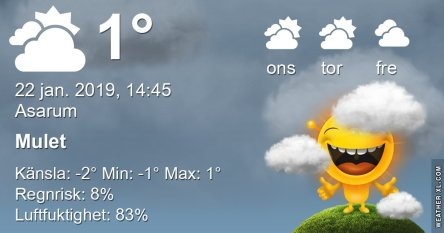

Idag går solen upp 08:14 och ned 16:11 Dagens längd är 7 timmar och 57 minuter. Det är gryning 07:31 och skymning 16:54 Det är dagsljus 9 timmar och 23 minuter. Månen går upp 18:07 och ned 09:03 Månen är belyst 99 %.

 Molnigt - 0,6 C  Vindby 0,3 m/s NW  Luftfuktighet 87 %  hPa 1009 Kl.02:20

 Molnigt och en del snö och regn - 0,3 C  Vindby 0,3 m/s NW  Luftfuktighet 86 %  hPa 1007  Snödjup ca 1,5 cm Kl.06:45

 Molnigt 2,4 C  Vindby 1,4 m/s S  Luftfuktighet 81 %  hPa 1006 Kl.14:20

 Molnigt - 0,6 C  Vindstilla  Luftfuktighet 85 %  hPa 1005 Kl.21:10

Varmare väder på väg!

Högst och lägst uppmätta temperatur igår (inofficiellt privat mätare) Max 1,7 C , Min – 2,2 C Högst uppmätta vind 2,4 m/s, Högst uppmätta vindby 4,8 m/s

Högst och lägst uppmätta temperatur igår (officiellt enligt [YR.NO](http://www.vackertvader.se/v%C3%A4derstation/karlshamn?utm_source=email&utm_medium=email&utm_campaign=asarum)) Max 1,2 C, Min – 2,3 C Högst uppmätta vind 2,3 m/s. Högst uppmätta vindby 6,2 m/s

\[gallery type="rectangular" link="file" size="large" ids="26831,26829,26828,26827"\]

Lite frostiga bilder som Johannes har tagit.

\[gallery type="circle" link="file" size="large" ids="26833,26832"\]

och en liten kungsfågel som han lyckades fånga på bild
