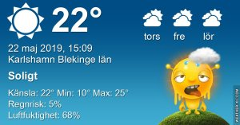

Idag går solen upp 04:35 och ned 21:20 Dagens längd är 16 timmar och 45 minuter. Det är gryning 03:42 och skymning 22:14 Det är dagsljus 18 timmar och 32 minuter. Månen går upp 00:11 och ned 07:12 Månen är belyst 89 %

 Halvklart 9,6 C  Vindstilla  Luftfuktighet 97 %  hPa 1004 Kl.02:15

 Tunna slöjmoln 21,6  C  Vindby 1 m/s N  Luftfuktighet 74 %  hPa 1004 Kl.07:50

 Tunna slöjmoln 27,9 C  Vindby 2,6 m/s E  Luftfuktighet 51 %  hPa 1004 Kl.14:00

 Halvklart 18 C  Vindby 4 m/s SSW  Luftfuktighet 69 %  hPa 1006 Kl.19:55

 Ännu en svettig och varm dag utan tillstymmelse till regn!

 

Högst och lägst uppmätta temperatur igår (inofficiellt privat mätare) Max 29,6 ( i solen ) , Min 11,5 C Högst uppmätta vind 2,4 m/s, Högst uppmätta vindby 4,1 m/s

Högst och lägst uppmätta temperatur igår (officiellt enligt [YR.NO](http://www.vackertvader.se/v%C3%A4derstation/karlshamn?utm_source=email&utm_medium=email&utm_campaign=asarum)) Max 22,2 C, Min 10,3 C Högst uppmätta vind 5,9 m/s. Högst uppmätta vindby 10,4 m/s

 

## _**Hoover Dame Nevada**_

\[gallery type="rectangular" link="file" size="large" ids="29098,29099,29100,29101,29102,29103,29104,29105,29106,29107,29108"\]

Vår enda utflykt idag var till Hoover Dame. Den här dammen förser hela Las Vegas med ström och med tanke på allt som lyser,blinkar och luftkonditionering som är igång 24 timmar om dygnet plus allt annat så är det mycket ström som produceras här. [Här](https://sv.wikipedia.org/wiki/Hooverdammen) kan du läsa mer om dammen om du vill.

 

## _**Las Vegas Nevada**_

\[gallery type="rectangular" link="file" size="large" ids="29109,29110,29111,29112,29113,29114,29115,29116,29117,29118,29119,29120,29121,29122,29123,29124,29126,29127,29128,29129,29130,29131"\]

Tillbaks i Vegas ger vi oss ut på stan för att se den i dagsljus. Vi börjar med att åka upp i The High Roller för att se utsikten över stan. Man ser väldigt tydligt att man är mitt ute i ödemarken med bara öken runtomkring. Det är otroligt varmt och vi fortsätter vår färd genom staden efter hjulet ganska slaka och törstiga. Mer om det kommer imorgon.
