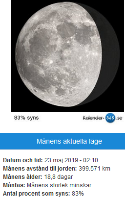

Idag går solen upp 04:13 och ned 21:52 Dagens längd är 17 timmar och 39 minuter. Det är gryning 03:09 och skymning 22:56 Det är dagsljus 19 timmar och 47 minuter. Månen går upp 00:40 och ned 09:15 Månen är belyst 81 %

 Mest klart 7,5 C  Vindby 0,3 m/s W  Luftfuktighet 96 %  hPa 1015 Kl.01:20

 Växlande molnighet 19,5 C  Vindby 3 m/s NW  Luftfuktighet 51 %  hPa 1018 Kl.09:10

 Växlande molnighet 22,8 C  Vindby 2,4 m/s ESE  Luftfuktighet 31 %  hPa 1019 Kl.13:15

 Mest klart 19,1 C  Vindby 3,4 m/s E  Luftfuktighet 42 %  hPa 1018 Kl.20:05

 Soligt och varmt men inte jättevarmt!

Högst och lägst uppmätta temperatur igår (inofficiellt privat mätare) Max 28,5 ( i solen )  , Min 9,5 C Högst uppmätta vind 3,1 m/s, Högst uppmätta vindby 6,1 m/s

Högst och lägst uppmätta temperatur igår (officiellt enligt [YR.NO](http://www.vackertvader.se/v%C3%A4derstation/karlshamn?utm_source=email&utm_medium=email&utm_campaign=asarum)) Max 20,3 C, Min 8,9 C Högst uppmätta vind 3,4 m/s. Högst uppmätta vindby 11,3 m/s

 

 Efter en lång dag i Skåne med massor av vacker natur så finns inte mycket tid kvar för bloggen, så den här bilden på dessa oemotståndliga katter får bli dagens bild. Imorgon kommer bilder från vårt besök i Skåne.
