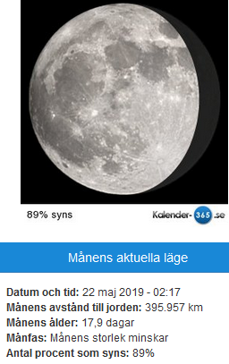

Idag går solen upp 07:08 och ned 17:21 Dagens längd är 10 timmar och 13 minuter. Det är gryning 06:30 och skymning 17:59 Det är dagsljus 11 timmar och 29 minuter. Månen går upp 22:50 och ned 08:56 Månen är belyst 85 %

 Mest molnigt - 1,3 C  Vindby 2,4 m/s NW  Luftfuktighet 61 %  hPa 1040 Kl.01:20

 Mest klart - 0,3 C  Vindby 0,3 m/s ESE  Luftfuktighet 69 %  hPa 1037 Kl.07:00

 Mest klart 10,9 C  Vindby 3,6 m/s ENE  Luftfuktighet 40 %  hPa 1035 Kl.13:35

 Mest klart - 1,4 C  Vindby 0,3 m/s W  Luftfuktighet 74 %  hpa 1033 Kl.22:15

 Idag har det varit soligt och fint med vår i luften!

Högst och lägst uppmätta temperatur igår (inofficiellt privat mätare) Max 8,8 ( i solen ) , Min – 5,7 C Högst uppmätta vind 2,4 m/s, Högst uppmätta vindby 3,1 m/s

Högst och lägst uppmätta temperatur igår (officiellt enligt [YR.NO](http://www.vackertvader.se/v%C3%A4derstation/karlshamn?utm_source=email&utm_medium=email&utm_campaign=asarum)) Max 1,3 C, Min – 4,1 C Högst uppmätta vind 2 m/s. Högst uppmätta vindby 7,2 m/s

\[gallery type="rectangular" link="file" size="large" ids="27425,27424,27423,27422,27421,27420,27419,27418" orderby="rand"\]

Ikväll har vi sett Joe Labero och Rackartygarna. Det var en riktigt häftig show! Han var otroligt skicklig och rolig.
