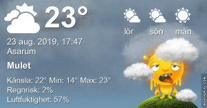

## Fredag 23 augusti

I dag gryr dagen i Asarum 05:04. Solen går upp klockan 05:46 och ner klockan 20:19 . Det mörknar vid 21:01. Dagens längd är 14 timmar och 33 minuter. Det är dagsljus 15 timmar och 57 minuter. Månen går upp 23:19 och ned 14:20 Månen är belyst 56 %

I Asarum blir dagen 4 minuter och 32 sekunder kortare. Dagen har blivit 3 timmar och 6 minuter kortare sedan sommarsolståndet. Vintersolstånd om 121 dagar.

Missa inte gyllene timmen som börjar klockan 19:31 i Asarum. Då står solen lågt och kastar ett fint gyllene ljus.

 

 Tunna slöjmoln 13,5 C  Vindstilla  Luftfuktighet 93 %  hPa 1020 Kl.01:45

 Molnigt 14,8 C  Vindby 0,3 m/s SE  Luftfuktighet 96 %  hPa 1019 Kl.07:00

 Tunna slöjmoln 27,9 C  Vindby 4,8 m/s ESE  Luftfuktighet 26 %  hPa 1019 Kl.14:45

 Molnigt 18,7 C  Vindby 0,3 m/s SW  Luftfuktighet 70 %  hPa 1020 Kl.20:25

 Nu är det varmt och svettigt igen!

 

Högst och lägst uppmätta temperatur igår (inofficiellt privat mätare) Max 25,7 ( i solen ) , Min 4,9 C Högst uppmätta vind 3,1 m/s, Högst uppmätta vindby 5,4 m/s

Högst och lägst uppmätta temperatur igår (officiellt enligt [YR.NO](http://www.vackertvader.se/v%C3%A4derstation/karlshamn?utm_source=email&utm_medium=email&utm_campaign=asarum)) Max 20,6 C, Min 4,2 C Högst uppmätta vind 3,8 m/s. Högst uppmätta vindby 7,9 m/s

 

## _**Otroligt vacker soluppgång och en tupp som inte vill vara med på bild**_

 

\[gallery type="rectangular" link="file" size="large" ids="31343,31344,31345,31346,31347,31348,31349,31350,31351,31352,31353,31354,31355"\]
