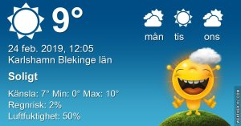

Idag går solen upp 07:06 och ned 17:23 Dagens längd är 10 timmar och 17 minuter. Det är gryning 06:28 och skymning 18:01 Det är dagsljus 11 timmar och 33 minuter. Månen går upp 22:46 och ned 09:19 Månen är belyst 76 %

 Molnigt 0,4 C  Vindstilla  Luftfuktighet 64 %  hPa 1031 Kl.01:30

 Mest klart 1,7 C  Vindby 0,3 m/s SE  Luftfuktighet 70 %  hPa 1030 Kl.07:00

 Mest klart 18,6 C  Vindby 2,6 m/s NNE  Luftfuktighet 24 %  hPa 1028 Kl.14:00

 Växlande molnighet 2,9 C  Vindby 1,7 m/s S  Luftfuktighet 87 %  hPa 1030 Kl.19:50

 Vilken härlig dag med sol och sommarvärme! Äntligen!

Högst och lägst uppmätta temperatur igår (inofficiellt privat mätare) Max 11,2 ( i solen ) , Min – 1,4 C Högst uppmätta vind 2,7 m/s, Högst uppmätta vindby 4,4 m/s

Högst och lägst uppmätta temperatur igår (officiellt enligt [YR.NO](http://www.vackertvader.se/v%C3%A4derstation/karlshamn?utm_source=email&utm_medium=email&utm_campaign=asarum)) Max 7,2 C, Min – 0,8 C Högst uppmätta vind 1,1 m/s. Högst uppmätta vindby 7,1 m/s

\[gallery type="rectangular" link="file" size="large" ids="27441,27442,27447,27448,27443,27444,27449,27450,27445,27446,27451" orderby="rand"\]

Idag fick jag äntligen inspiration till att gå ut och ta lite bilder. Det var en helt underbar dag med sommarvärme i solen. Jag gick utan jacka utan att frysa det minsta. Man kunde verkligen inte tro att det var Februari bara. Jag hade turen att få se en ormvråk men den satt på så långt avstånd så jag fick inga bra bilder på den. Med lite redigering så lyckades jag få till en av bilderna lite halvbra dock.
