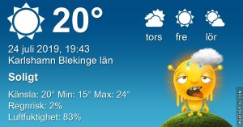

Idag går solen upp 04:48 och ned 21:25 Dagens längd är 16 timmar och 37 minuter. Det är gryning 03:56 och skymning 22:17 Det är dagsljus 18 timmar och 21 minuter. Månen går upp 00:03 och ned 12:54 Månen är belyst 60 %

 Klart 14 C  Vindstilla  Luftfuktighet 96 %  hPa 1014 Kl.01:55

 Halvklart 28,2 C  Vindby 0,3 m/s W  Luftfuktighet 78 %  hPa 1014 Kl.06:55

 Växlande molnighet 29,2 C  Vindby 2,6 m/s W  Luftfuktighet 62 %  hPa 1015 KL.14:45

 Halvklart 20,4 C  Vindby 0,7 m/s N  Luftfuktighet 73 %  hPa 1015 Kl.20:00

 Det är för varmt för att göra något överhuvudtaget!

Högst och lägst uppmätta temperatur igår (inofficiellt privat mätare) Max 29 ( i solen )  , Min 14 C Högst uppmätta vind 2,4 m/s, Högst uppmätta vindby 3,7 m/s

Högst och lägst uppmätta temperatur igår (officiellt enligt [YR.NO](http://www.vackertvader.se/v%C3%A4derstation/karlshamn?utm_source=email&utm_medium=email&utm_campaign=asarum)) Max 23,6 C, Min 14 C Högst uppmätta vind 3,1 m/s. Högst uppmätta vindby 6,9 m/s

 

## _**I brist på ork och motivation...**_

får Minionerna tala istället

\[gallery type="rectangular" link="file" size="large" ids="30669,30670,30671,30672,30673,30674"\]
