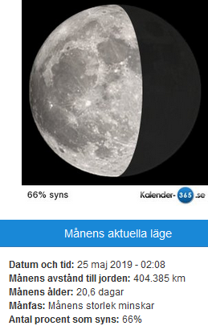

Idag går solen upp 05:51 och ned 18:24 Dagens längd är 12 timmar och 33 minuter. Det är gryning 05:13 och skymning 19:02 Det är dagsljus 13 timmar och 49 minuter. Månen går upp 23:04 och ned 08:04 Månen är belyst 80 %

 Halvklart - 0,4 C  Vindby 1 m/s E  Luftfuktighet 85 %  hPa 1007 Kl.01:15

 Mest molnigt - 1,4 C  Vindstilla  Luftfuktighet 84 %  hPa 1004 Kl.06:15

 Växlande molnighet 12,1 C  Vindby 2 m/s NW  Luftfuktighet 47 %  hPa 1008 Kl.13:20

 Mest klart 0 C  Vindby 0,7 m/s SW  Luftfuktighet 69 %  hPa 1013 Kl.20:05

 Idag har det varit sol, blåst, regn och hagel i en salig blandning. Och varmt och kallt om vartannat.

Högst och lägst uppmätta temperatur igår (inofficiellt privat mätare) Max 17,3 , Min 0,2 C Högst uppmätta vind 3,4 m/s, Högst uppmätta vindby 5,1 m/s

Högst och lägst uppmätta temperatur igår (officiellt enligt [YR.NO](http://www.vackertvader.se/v%C3%A4derstation/karlshamn?utm_source=email&utm_medium=email&utm_campaign=asarum)) Max 10,7 C, Min -1,8 C Högst uppmätta vind 3,9 m/s. Högst uppmätta vindby 9,2 m/s

 Några fotomontage gjort av några äldre bilder från arkivet.

 Och två lekbilder med kloka ord.
