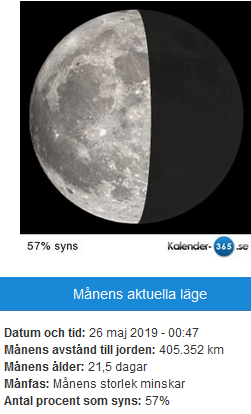
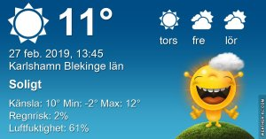

Idag går solen upp 06:58 och ned 17:29 Dagens längd är 10 timmar och 31 minuter. Det är gryning 06:21 och skymning 18:07 Det är dagsljus 11 timmar och 46 minuter. Månen går upp 02:45 och ned 10:31 Månen är belyst 44 %

 Tunna moln - 0,9 C  Vindstilla  Luftfuktighet 93 %  hPa 1022 Kl.02:20

 Halvklart och disigt - 3,3 C  Vindstilla  Luftfuktighet 99 %  hPa 1018 Kl.07:35

 Slöjmoln och soldis 18.6 C  Vindby 3 m/s W  Luftfuktighet 46 %  hPa 1013 Kl.13:55

 Halvklart 5,5 C  Vindby 3,1 m/s E  Luftfuktighet 65 %   hPa 1007 Kl.20:00

 Ännu en härlig vårdag med sol och värme. Men nu ska det bli kallare igen, tyvärr.

Högst och lägst uppmätta temperatur igår (inofficiellt privat mätare) Max 23,4 ( i solen ) , Min - 1,2 C Högst uppmätta vind 2,7 m/s, Högst uppmätta vindby 4,8 m/s

Högst och lägst uppmätta temperatur igår (officiellt enligt [YR.NO](http://www.vackertvader.se/v%C3%A4derstation/karlshamn?utm_source=email&utm_medium=email&utm_campaign=asarum)) Max 15,5 C, Min - 0,9 C Högst uppmätta vind 2,6 m/s. Högst uppmätta vindby 7,9 m/s

 Idag hade jag riktigt fint besök i trädgården. Det här är väl ett säkert vårtecken om något?

\[gallery type="rectangular" link="file" size="large" ids="27493,27494,27495"\]

Och så några kloka ord som avslut på en fin dag.
