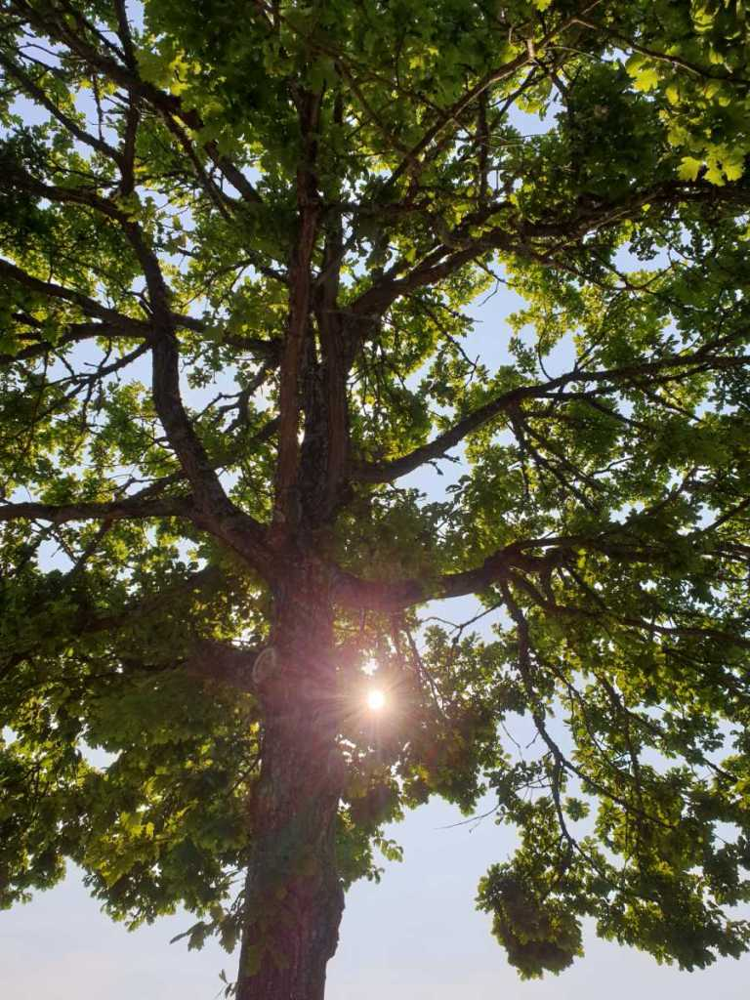

Idag går solen upp 04:14 och ned 21:52 Dagens längd är 17 timmar och 38 minuter. Det är gryning 03:11 och skymning 22:56 Det är dagsljus 19 timmar och 45 minuter. Månen går upp 01:43 och ned 13:59 Månen är belyst 45 %

 Halvklart 12,9 C  Vindstilla  Luftfuktighet 90 %  hPa 1017 Kl.01:20

 Mest molnigt 20,5 C  Vindstilla  Luftfuktighet 65 %  hPa 1014 Kl.06:30

 Mest tunna moln 29,5 C  Vindby 2,2 m/s NW  Luftfuktighet 52 %  hPa 1012 Kl.12:50

 Halvklart och blåsigt 23,5 C  Vindby 4,6 m/s WNW  Luftfuktighet 57 %  hPa 1009 Kl.20:05

 Idag har det varit outhärdligt varmt och det regn som var utlovat blev det inget av den här gången heller!

Högst och lägst uppmätta temperatur igår (inofficiellt privat mätare) Max 32,2 ( i solen )  , Min 9,8 C Högst uppmätta vind 2 m/s, Högst uppmätta vindby 4,4 m/s

Högst och lägst uppmätta temperatur igår (officiellt enligt [YR.NO](http://www.vackertvader.se/v%C3%A4derstation/karlshamn?utm_source=email&utm_medium=email&utm_campaign=asarum)) Max 23,6 C, Min 6,5 C Högst uppmätta vind 4,6 m/s. Högst uppmätta vindby 8,6 m/s

 

## _**En alldeles för varm dag!**_

 

 Stekande sol silar ner genom trädet.

 Så här blir resultatet! Det ser ut precis som förra året 😢
