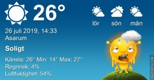

Idag går solen upp 04:52 och ned 21:21 Dagens längd är 16 timmar och 29 minuter. Det är gryning 04:00 och skymning 22:12 Det är dagsljus 18 timmar och 12 minuter. Månen går upp 00:34 och ned 15:21 Månen är belyst 40 %

 Mest klart 13,6 C  Vindstilla  Luftfuktighet 94 %  hPa 1015 Kl.02:25

 Mest klart 23,5 C  Vindby 0,3 m/s SW  Luftfuktighet 52 %  hPa 1015 Kl.07:35

 Växlande molnighet 30,7 C  Vindby 3,1 m/s SSE  Luftfuktighet 52 %  hPa 1014 Kl.14:40

 Halvklart 21,3 C  Vindby 1 m/s NNW  Luftfuktighet 63 %  hPa 1013 Kl.19:55

 

 Alldeles för varmt för att göra något annat än att sitta still och göra ingenting!

Högst och lägst uppmätta temperatur igår (inofficiellt privat mätare) Max 35,4 ( i solen )  , Min 13 C Högst uppmätta vind 2,4 m/s, Högst uppmätta vindby 3,4 m/s

Högst och lägst uppmätta temperatur igår (officiellt enligt [YR.NO](http://www.vackertvader.se/v%C3%A4derstation/karlshamn?utm_source=email&utm_medium=email&utm_campaign=asarum)) Max 25,7 C, Min 13,7 C Högst uppmätta vind 3,2 m/s. Högst uppmätta vindby 6,2 m/s

 

## _**Min nya hobby**_

Jag har gett mig in i klockbranschen och börjat göra urtavlor till träningsklockor. Bara som en rolig grej. Här är några av mina egenhändigt hopknåpade urtavlor som är gjorda på MR.TIME och FACER.

\[gallery type="square" link="file" size="large" ids="30709,30710,30711,30712,30713,30714,30715,30716,30720"\]
