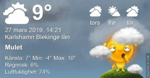

Idag går solen upp 05:45 och ned 18:28 Dagens längd är 12 timmar och 43 minuter. Det är gryning 05:08 och skymning 19:06 Det är dagsljus 13 timmar och 58 minuter. Månen går upp 01:35 och ned 09:03 Månen är belyst 62 %

 Mest klart - 6,1 C  Vidnby 0,3 m/s SW  Luftfuktighet 69 %  hPa 1018 Kl.01:35

 Molnigt 1 C  Vindby 1,6 m/s ESE  Luftfuktighet 81 %   hPa 1018 Kl.06:35

 Växlande molnighet 14,4 C  Vindby 3,4 m/s ENE  Luftfuktighet 58 %  hPa 1017 Kl.14:15

 Halvklart 3,8 C  Vindstilla  Luftfuktighet 77 %  hPa 1020 Kl.20:10

 Idag har det varit en del sol men också mycket moln.

Högst och lägst uppmätta temperatur igår (inofficiellt privat mätare) Max 14,5 , Min – 5,7 C Högst uppmätta vind 4,8 m/s, Högst uppmätta vindby 6,5 m/s

Högst och lägst uppmätta temperatur igår (officiellt enligt [YR.NO](http://www.vackertvader.se/v%C3%A4derstation/karlshamn?utm_source=email&utm_medium=email&utm_campaign=asarum)) Max 8,1 C, Min -4,8 C Högst uppmätta vind 6,4 m/s. Högst uppmätta vindby 13,9 m/s

 Efter en lång dag i trädgården när jag plötsligt fick energi att göra något (och det måste utnyttjas när det väl händer) så blir det bara en bild i dagens inlägg.
