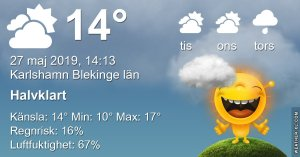

Idag går solen upp 04:28 och ned 21:28 Dagens längd är 17 timmar och 00 minuter. Det är gryning 03:32 och skymning 22:25 Det är dagsljus 18 timmar och 53 minuter. Månen går upp 02:53 och ned 12:44 Månen är belyst 47 %

 Molnigt och lite duggregn 9,3 C  Vindby 0,7 m/s W  Luftfuktighet 94 %  hPa 997 Kl.02:20

 Lätt regn 11,5 C  Vindby 1,8 m/s ESE  Luftfuktighet 97 %  hPa 995  Regn 1 mm Kl.07:05

 Växlande molnighet 22 C  Vindby 7 m/s W  Luftfuktighet 61 %  hPa 998 Kl.13:25

 Tunna slöjmoln 15,1 C  Vindby 2,8 m/s W  Luftfuktighet 58 %  hPa 999 Kl.19:30

 Det kom några droppar regn idag, men alldeles för lite tyvärr! Håller tummarna för mer.

Högst och lägst uppmätta temperatur igår (inofficiellt privat mätare) Max 20,1 ( i solen ) , Min 9,2 C Högst uppmätta vind 4,4 m/s, Högst uppmätta vindby 6,5 m/s

Högst och lägst uppmätta temperatur igår (officiellt enligt [YR.NO](http://www.vackertvader.se/v%C3%A4derstation/karlshamn?utm_source=email&utm_medium=email&utm_campaign=asarum)) Max 15,9 C, Min 10 C Högst uppmätta vind 4 m/s. Högst uppmätta vindby 8,9 m/s

 

## _**Horseshoe Bend Arizona**_

\[gallery type="rectangular" link="file" size="large" ids="29410,29411,29412,29413,29414,29415,29416,29417,29418,29419,29420,29421"\]

Idag var det dags för att besöka en av de mest efterlängtade platserna på turen, Horseshoe Bend. Bilderna tala för sig själv. Den här platsen är inte helt ofarlig att besöka. Det har varit en hel del olyckor här och även dödsfall. Det är trenden med selfies som ligger bakom det flesta olyckorna och senast var det en 14 årig flicka som störtade ner och dog här. Vår guide upprepade flera gånger hur viktigt det är att hålla sig inom säkerhetsområdet och inte riskera livet för att få den bästa bilden till Instagram. Jag kan inte förstå hur folk ändå går utanför dessa områden och ställer sig med ryggen mot stupet och tar selfisar. Speciellt inte med tanke på den kraftiga blåsten som det var här. [Här](https://www.diyphotography.net/a-teen-falls-to-death-at-horseshoe-bend-a-popular-photo-destination/) kan du läsa om olyckor vid Horseshoe Bend och Yosemite Park.
