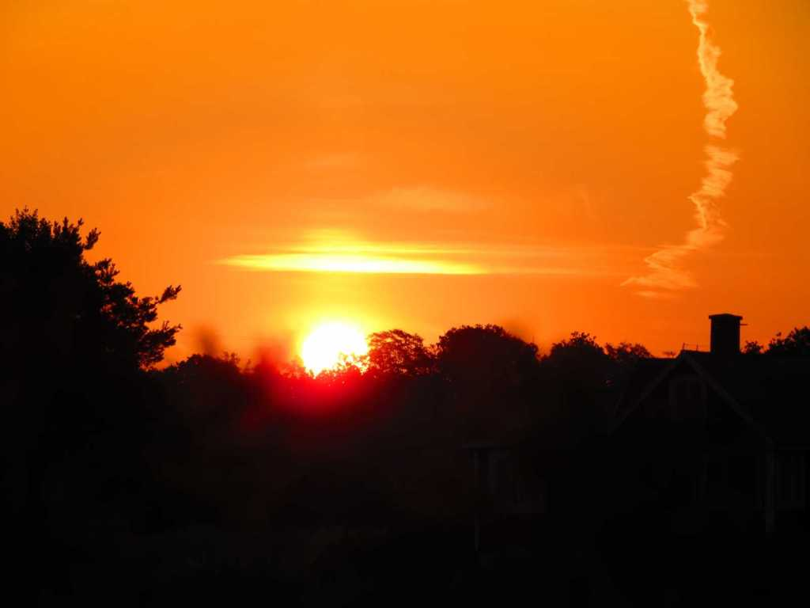

Idag går solen upp 04:54 och ned 21:19 Dagens längd är 16 timmar och 25 minuter. Det är gryning 04:02 och skymning 22:10 Det är dagsljus 18 timmar och 8 minuter. Månen går upp 00:54 och ned 16:37 Månen är belyst 31 %

 Halvklart 15,7 C  Vindby 2,4 m/s N  Luftfuktighet 86 %  hPa 1012 Kl.01:50

 Tunna slöjmoln 18,3 C  Vindby 2 m/s W  Luftfuktighet 78 %  hPa 1011 Kl.06:45

 Molnigt 26,6 C  Vindby 5,8 m/s SW  Luftfuktighet 97 %  hPa 1009 Kl.14:35

Växlande molnighet 23,3 C  Vindby 3,8 m/s W  Luftfuktighet 61 %  hPa 1007 KL.20:05

 Än har inte en droppe av det utlovade regnet kommit!

 

Högst och lägst uppmätta temperatur igår (inofficiellt privat mätare) Max 34,3 ( i solen )  , Min 13,1 C Högst uppmätta vind 2,7 m/s, Högst uppmätta vindby 5,8 m/s

Högst och lägst uppmätta temperatur igår (officiellt enligt [YR.NO](http://www.vackertvader.se/v%C3%A4derstation/karlshamn?utm_source=email&utm_medium=email&utm_campaign=asarum)) Max 26,9 C, Min 12,8 C Högst uppmätta vind 5,1 m/s. Högst uppmätta vindby 10,1 m/s

 

## _**Tidig morgon**_

Men fler än jag är uppe. Före semestern var det ljust när jag var här. Nu är det så mörkt så att jag fick rikta billyset mor de här figurerna för att kunna ta några bilder på dem.

\[gallery type="rectangular" link="file" size="large" ids="30736,30737,30738,30739"\]

## _**Olika viljor...**_

verkar det vara här. Alla drar åt olika håll!

\[gallery type="circle" link="file" size="large" ids="30740,30741"\]

## _**Soluppgång igen**_

