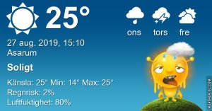

## Tisdag 27 augusti

I dag gryr dagen i Asarum 05:13. Solen går upp klockan 05:54 och ner klockan 20:09 . Det mörknar vid 20:50. Dagens längd är 14 timmar och 15 minuter. Det är dagsljus 15 timmar och 37 minuter. Månen går upp 01:30 och ned 18:46 Månen är belyst 17 %

I Asarum blir dagen 4 minuter och 31 sekunder kortare. Dagen har blivit 3 timmar och 24 minuter kortare sedan sommarsolståndet. Vintersolstånd om 117 dagar.

Missa inte gyllene timmen som börjar klockan 19:21 i Asarum. Då står solen lågt och kastar ett fint gyllene ljus.

 Mest klart 14,2 C  Vindby 0,7 m/s W  Luftfuktighet 90 %  hPa 1018 Kl.01:40

 Halvklart 15,9 C  Vindby 1,2 m/s N  Luftfuktighet 91 %  hPa 1018 Kl.07:00

 Halvklart 33,1 C  Vindby 2 m/s SSE  Luftfuktighet 39 %  hPa 1017 Kl.14:20

 Växlande molnighet 19 ,9 C  Vindby 1,6 m/s E  Luftfuktighet 64 %  hPa 1016 Kl.21:00

På tok för varmt!

Högst och lägst uppmätta temperatur igår (inofficiellt privat mätare) Max 35,4 ( i solen ) , Min 11,7 C Högst uppmätta vind 2 m/s, Högst uppmätta vindby 2,7 m/s

Högst och lägst uppmätta temperatur igår (officiellt enligt [YR.NO](http://www.vackertvader.se/v%C3%A4derstation/karlshamn?utm_source=email&utm_medium=email&utm_campaign=asarum)) Max 26 C, Min 9,6 C Högst uppmätta vind 3,6 m/s. Högst uppmätta vindby 6,3 m/s

## _**Helt otroligt vacker soluppgång idag!**_

 

\[gallery type="rectangular" link="file" size="large" ids="31427,31446,31445,31444,31443,31442,31441,31440,31439,31438,31437,31436,31435,31434,31433,31432,31431,31430,31429,31428"\]
