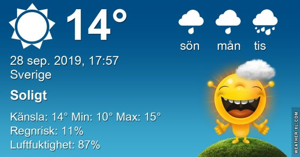

## Lördag 28 September

I dag gryr dagen i Asarum 06:20. Solen går upp klockan 06:57 och ner klockan 18:45 . Det mörknar vid 19:22. Dagens längd är 11 timmar och 48 minuter. Det är dagsljus 13 timmar och 02 minuter. Månen går upp 05:59 och ned 19:07 Månen är belyst 1 %

I Asarum blir dagen 4 minuter och 40 sekunder kortare. Dagen har blivit 5 timmar och 42 minuter kortare sedan sommarsolståndet. Vintersolstånd om 85 dagar.

Missa inte gyllene timmen som börjar klockan 17:57 i Asarum. Då står solen lågt och kastar ett fint gyllene ljus

 

 Molnigt och dimma 11,7 C  Vindstilla  Luftfuktighet 97 %  hPa 1002 Kl.02:15

 

 Dimma 10,9 C  Vindby 0,3 m/s W  Luftfuktighet 98 %  hPa 1002 Kl.07:00

 Växlande molnighet 20,9 C  Vindby 2 m/s S  Luftfuktighet 77 %  hPa 1001 Kl.15:55

 Växlande molnighet 9,1 C  Vindstilla  Luftfuktighet 94 %  hPa 1000 Kl.19:55

Tjock dimma och sen sol och blå himmel och imorgon ska det bli regn igen.

Högst och lägst uppmätta temperatur igår (inofficiellt privat mätare) Max 16,1, Min 9,1 C Högst uppmätta vind 2 m/s, Högst uppmätta vindby 5,1 m/s

Högst och lägst uppmätta temperatur igår (officiellt enligt [YR.NO](http://www.vackertvader.se/v%C3%A4derstation/karlshamn?utm_source=email&utm_medium=email&utm_campaign=asarum)) Max 14,8 C, Min 10 C Högst uppmätta vind 5,3 m/s. Högst uppmätta vindby 9,4 m/s

 

## _**Begränsat synfält..**_

hade jag inatt i den här gröttjocka dimman!

\[gallery type="rectangular" link="file" size="large" ids="32127,32128,32129,32130,32131,32132,32133,32134,32135,32136,32137,32138,32139,32140,32141,32142,32143"\]
