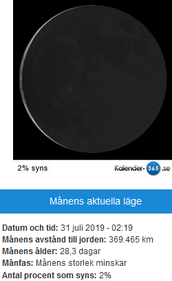
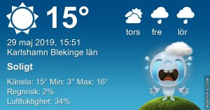
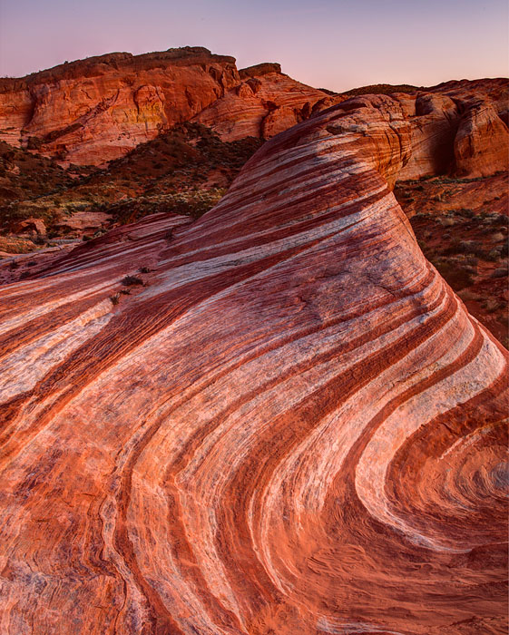

Idag går solen upp 04:25 och ned 21:31 Dagens längd är 17 timmar och 06 minuter. Det är gryning 03:29 och skymning 22:29 Det är dagsljus 19 timmar och 00 minuter. Månen går upp 03:22 och ned 15:06 Månen är belyst 29 %

 Klart 1,1 C  Vindstilla  Luftfuktighet 94 %  hPa 1006 Kl.02:15

 Mest klart 13,4 C  Vindby 4,4 m/s WSW  Luftfuktighet 52 %  hPa 1010 Kl.07:45

 Mest klart 21,1 C  Vindby 5,6 WSW  Luftfuktighet 25 %  hPa 1013 Kl.13:40

 Mest klart 13,4 C  Vindby 3 m/s E  Luftfuktighet 33 %  hPa 1016 Kl.19:40

 

 Soligt och blåsigt... och torrt!

Högst och lägst uppmätta temperatur igår (inofficiellt privat mätare) Max 23,2 ( i solen ) , Min 4,8 C Högst uppmätta vind 3,4 m/s, Högst uppmätta vindby 5,1 m/s

Högst och lägst uppmätta temperatur igår (officiellt enligt [YR.NO](http://www.vackertvader.se/v%C3%A4derstation/karlshamn?utm_source=email&utm_medium=email&utm_campaign=asarum)) Max 16,1 C, Min 1,9 C Högst uppmätta vind 4,2 m/s. Högst uppmätta vindby 8,1 m/s

 

## _**Glen Canyon Dam**_

 

\[gallery type="rectangular" link="file" size="large" ids="29451,29452,29453,29454,29455,29456,29457,29458,29459,29460,29461,29462,29463,29464,29465,29466"\]

Nu är vi inne på de sista stoppen på vår resa. Först stannar vi vid [Glen Cenyon Dam](https://sv.wikipedia.org/wiki/Glen_Canyon_Dam) och nu börjar mörka moln torna upp sig och de varnar för att ett ordentligt åskväder med kraftigt regn är på väg. Vårt nästa stopp är Valley of Fire och om det blir åska så kommer vi inte att kunna gå ner i dalen på grund av säkerhet. Vi hoppas att regnet och åskan håller sig borta ett tag till så vi får se det sista på vår resa också.

 

##  _**Valley of Fire Nevada**_

 

\[gallery type="rectangular" link="file" size="large" ids="29467,29468,29469,29470,29471,29472,29473,29474,29475,29476,29477,29478,29479,29486,29487,29488,29489,29490,29491,29492,29493,29494"\]

Tyvärr ville inte ovädret vänta utan på vägen till Valley of Fire satte det igång med kraftig blåst så bussen svajade och regnet vräkte ner och det åskade ordentligt bitvis. Så vi kom aldrig ner i dalen där de flerfärgade klipporna är utan vi fick nöja oss med ett stopp vid Visitors centret och sedan åkte vi genom dalen med bussen. På grund av regnet gick det inte att ta bilder när vi åkte genom dalen men vid centret där vi stannade kunde jag ta några bilder i alla fall. Det var otroligt vackert i hela dalen, men jag hade verkligen önskat att vi hade fått se de flerfärgade klipporna. Men man kan ju inte få allt här i världen och vi fick ju trots allt se det vi kom dit för plus mycket annat också. Så efter Valley of Fire så styrde vi kosan mot Las Vegas igen för en sista kväll där innan det var dags att flyga hem igen.

 

 Bild från internet på hur det såg ut när vi körde genom dalen. Det var otroligt vackert!

 

 Bild från internet på det vi tyvärr inte fick se!
