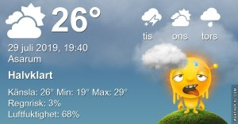

Idag går solen upp 04:57 och ned 21:16 Dagens längd är 16 timmar och 19 minuter. Det är gryning 04:07 och skymning 22:05 Det är dagsljus 17 timmar och 58 minuter. Månen går upp 01:57 och ned 17:04 Månen är belyst 13 %

 Mest molnigt 19,4 C  Vindby 2,8 m/s W  Luftfuktighet 81 %  hPa 1005 Kl.02:15

 Tunna moln 21 C  Vindby 1,6 m/s N  Luftfuktighet 75 %  hPa 1005 Kl.06:40

 Tunna moln 35,4 C  Vindby 2,2 m/s E  Luftfuktighet 41 %  hPa 1005 Kl.14:40

 Molnigt 26,1 C  Vindby 0,3 m/s WNW  Luftfuktighet 64 %  hPa 1005 Kl.19:45

 Åska och några blixtar men ännu inget regn!

 

Högst och lägst uppmätta temperatur igår (inofficiellt privat mätare) Max 33,7 ( i solen )  , Min 16,8 C Högst uppmätta vind 3,7 m/s, Högst uppmätta vindby 6,6 m/s

Högst och lägst uppmätta temperatur igår (officiellt enligt [YR.NO](http://www.vackertvader.se/v%C3%A4derstation/karlshamn?utm_source=email&utm_medium=email&utm_campaign=asarum)) Max 27,5 C, Min 17,9 C Högst uppmätta vind 5 m/s. Högst uppmätta vindby 11,6 m/s

 

## _**Fler urtavlor...**_

som jag har gjort i brist i ork till annat

\[gallery type="rectangular" link="file" size="large" ids="30784,30785,30786,30787,30788,30789,30790,30791,30792,30793,30794,30795,30796,30797"\]
