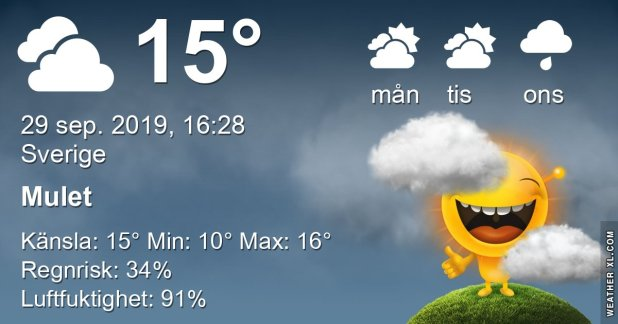

## Söndag 29 September

I dag gryr dagen i Asarum 06:22. Solen går upp klockan 06:59 och ner klockan 18:42 . Det mörknar vid 19:19. Dagens längd är 11 timmar och 43 minuter. Det är dagsljus 12 timmar och 57 minuter. Månen går upp 07:30 och ned 19:24 Månen är belyst 0 %

I Asarum blir dagen 4 minuter och 40 sekunder kortare. Dagen har blivit 5 timmar och 57 minuter kortare sedan sommarsolståndet. Vintersolstånd om 84 dagar.

Missa inte gyllene timmen som börjar klockan 17:55 i Asarum. Då står solen lågt och kastar ett fint gyllene ljus

 Molnigt 12,2 C  Vindby 1,4 m/s S  Luftfuktighet 97 %  hPa 998 Kl.01:30

 Molnigt 10,7 C  Vindby 0,3 m/s E  Luftfuktighet 97 %  hPa 995  Regn 2,7 mm Kl.06:55

 Mest molnigt 15,6 C  Vindby 2,4 m/s E  Luftfuktighet 78 %  hPa 993 Kl.13:20

 Mest molnigt 12,2 C  Vindby 1 m/s E  Luftfuktighet 97 %  hPa 989  Regn 4 mm Kl.19:45

Idag har det varit lagom varmt och lite sol

Högst och lägst uppmätta temperatur igår (inofficiellt privat mätare) Max 22,1, Min 6,7 C Högst uppmätta vind 1,7 m/s, Högst uppmätta vindby 2,4 m/s

Högst och lägst uppmätta temperatur igår (officiellt enligt [YR.NO](http://www.vackertvader.se/v%C3%A4derstation/karlshamn?utm_source=email&utm_medium=email&utm_campaign=asarum)) Max 16,3 C, Min 7,6 C Högst uppmätta vind 2,1 m/s. Högst uppmätta vindby 5,4 m/s

 

## _**Satt ur spel...**_

har jag varit hela helgen på grund av min onda rygg 😌

## _**Därför...**_

blir det bara några urtavlor idag

\[gallery type="circle" link="file" size="large" ids="32158,32159,32160,32161,32162,32163,32164,32165,32166,32167,32168,32169,32170,32171,32172,32173,32174,32175"\]
