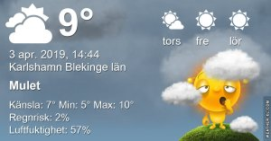

Idag går solen upp 06:27 och ned 19:42 Dagens längd är 13 timmar och 15 minuter. Det är gryning 05:48 och skymning 20:21 Det är dagsljus 14 timmar och 33 minuter. Månen går upp 06:37 och ned 17:16 Månen är belyst 5 %

 Växlande molnighet 4,8 C  Vindby 3,8 m/s NNW  Luftfuktighet 54 %  hPa 1007 Kl.01:30

 Molnigt 3,9 C  Vindby 3,6 m/s NNE  Luftfuktighet 59 %  hPa 1006 Kl.05:55

 Molnigt och soldis 13,2 C  Vindby 3,4 m/s E  Luftfuktighet 38 %  hPa 1006 Kl.13:50

 Molnigt 8,1 C  Vindby 2,6 m/s NE  Luftfuktighet 51 %  hPa 1005 Kl.19:55

 Tröttväder igen! Grått och kallt!

Högst och lägst uppmätta temperatur igår (inofficiellt privat mätare) Max 13,2 (i solen) , Min – 0,8 C Högst uppmätta vind 4,8 m/s, Högst uppmätta vindby 7,8 m/s

Högst och lägst uppmätta temperatur igår (officiellt enligt [YR.NO](http://www.vackertvader.se/v%C3%A4derstation/karlshamn?utm_source=email&utm_medium=email&utm_campaign=asarum)) Max 7,7 C, Min 2,3 C Högst uppmätta vind 7,1 m/s. Högst uppmätta vindby 13,4 m/s

 Några nya citat och kloka ord för dagen.
