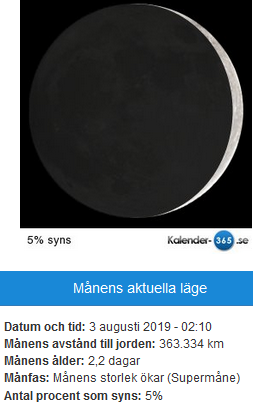
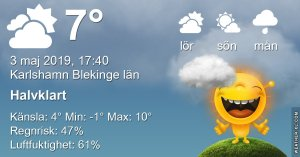

Idag går solen upp 05:12 och ned 20:44 Dagens längd är 15 timmar och 32 minuter. Det är gryning 04:27 och skymning 21:30 Det är dagsljus 17 timmar och 03 minuter. Månen går upp 05:29 och ned 18:37 Månen är belyst 4 %

 Mest klart - 0,7 C  Vindby 0,3 m/s SE  Luftfuktighet 91 %  hPa 995 Kl.02:55

 Växlande molnighet 9 C  Vindby 0,7 m/s SE  Luftfuktighet 67 %  hPa 998 Kl.07:30

 Molnigt 10,8 C  Vindby 0,7 m/s SE  Luftfuktighet 66 %  hPa 998 Kl.13:50

 Växlande molnighet 2,2 C  Vindby 1 m/s SE  Luftfuktighet 76 %  hPa 997  Regn 1,5 mm Kl.20:30

 Det är regn och sol om vartannat här idag. Regnet behövs verkligen och gräsmattan börjar så smått att återhämta sig en del.

Högst och lägst uppmätta temperatur igår (inofficiellt privat mätare) Max 15,8 , Min 1,6 C Högst uppmätta vind 5,4 m/s, Högst uppmätta vindby 9,2 m/s

Högst och lägst uppmätta temperatur igår (officiellt enligt [YR.NO](http://www.vackertvader.se/v%C3%A4derstation/karlshamn?utm_source=email&utm_medium=email&utm_campaign=asarum)) Max 12,2 C, Min 2,3 C Högst uppmätta vind 5,5 m/s. Högst uppmätta vindby 15,6 m/s

\[gallery type="rectangular" link="file" size="large" ids="28351,28350,28349,28348,28347,28346,28345"\]

Här är några bilder som jag tog från planet när vi flög över Grönland på vägen till USA.

\[gallery type="rectangular" link="file" size="large" ids="28356,28355,28354,28353,28352"\]

Och här är några bilder som jag tog när vi gick in för landning i Chicago för byte av plan vidare till Los Angeles.
