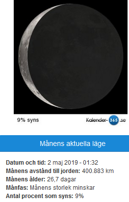

Idag går solen upp 04:19 och ned 21:50 Dagens längd är 17 timmar och 31 minuter. Det är gryning 03:17 och skymning 22:51 Det är dagsljus 19 timmar och 34 minuter. Månen går upp 05:02 och ned 22:19 Månen är belyst 0 %

 Mest klart 6,3 C  Vindby 0,7 m/s NE  Luftfuktighet 86 %  hPa 1010 Kl.01:25

 Växlande molnighet 15,4 C  Vindby 1 m/s E  Luftfuktighet 64 %  hPa 1010 Kl.07:00

 Växlande molnighet 25,1 C  Vindby 5,4 m/s SE  Luftfuktighet 31 %   hPa 1011 Kl.14:40

 Växlande molnighet 13,3 C  Vindby 4,4 m/s E  Luftfuktighet 43 %  hPa 1011 Kl.20:25

 Blåsigt men lagom varmt.

Högst och lägst uppmätta temperatur igår (inofficiellt privat mätare) Max 23,2 ( i solen )  , Min 7,7 C Högst uppmätta vind 4,1 m/s, Högst uppmätta vindby 9,9 m/s

Högst och lägst uppmätta temperatur igår (officiellt enligt [YR.NO](http://www.vackertvader.se/v%C3%A4derstation/karlshamn?utm_source=email&utm_medium=email&utm_campaign=asarum)) Max 17,5 C, Min 8,9 C Högst uppmätta vind 5 m/s. Högst uppmätta vindby 14,5 m/s

 

## _**Mersey Ferry Liverpool**_

 

Här är några bilder som jag tog från vår båttur med [Mersey Ferry](https://en.wikipedia.org/wiki/Mersey_Ferry) i Liverpool. Det är de här färjorna som Gerry & the Pacemakers sjunger om i låten Ferry cross the Mersey.

 

\[gallery type="rectangular" link="file" size="large" ids="30259,30260,30261,30263,30264,30265,30266,30267,30268,30269,30270,30271,30272,30273,30274,30275,30276"\]

Tyvärr vet jag inte vad alla byggnader heter, men eftersom jag är lite av ett fan när det gäller byggnader och hus så fotar jag allt som ser intressant ut oavsett om jag vet vad det är eller inte. Jag forskar vidare för att se om jag hittar vad byggnaderna heter.

https://www.youtube.com/watch?v=os4\_U3\_L5nY

Ferry cross the Mersey med Gerry & The Pacemakers
