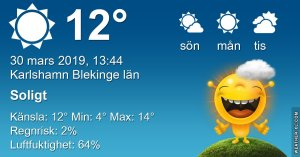

Idag går solen upp 05:37 och ned 18:34 Dagens längd är 12 timmar och 57 minuter. Det är gryning 04:59 och skymning 19:12 Det är dagsljus 14 timmar och 13 minuter. Månen går upp 04:09 och ned 11:42 Månen är belyst 33 %

 Mest klart 4,5 C  Vindby 1,7 m/s E  Luftfuktighet 75 %  hPa 1017 Kl.01:25

 Molnigt och disigt 2,7 C  Vindby 1,8 m/s SSE  Luftfuktighet 85 %  hPa 1016 Kl.06:00

 Halvklart 18,2 C  Vindby 5,8 m/s S  Luftfuktighet 40 %  hPa 1013 Kl.13:25

 Halvklart 8,4 C  Vindby 2,4 m/s ENE  Luftfuktighet 67 %  hPa 1009 Kl.19:50

 Efter en mulen morgon blev det en solig men blåsig dag.

Högst och lägst uppmätta temperatur igår (inofficiellt privat mätare) Max 18,8 (i solen) , Min 4,5 C Högst uppmätta vind 5,8 m/s, Högst uppmätta vindby 8,5 m/s

Högst och lägst uppmätta temperatur igår (officiellt enligt [YR.NO](http://www.vackertvader.se/v%C3%A4derstation/karlshamn?utm_source=email&utm_medium=email&utm_campaign=asarum)) Max 14,9 C, Min 5,3 C Högst uppmätta vind 4,9 m/s. Högst uppmätta vindby 12,9 m/s

\[gallery type="rectangular" link="file" size="large" ids="28057,28056,28055" orderby="rand"\]

Det blev en fin soluppgång idag igen innan molnen tog över.

 Inatt är det dags för den förhatliga klockomställningen igen. Men nu är det i alla fall bestämt att vi ska sluta med det i EU. År 2021 ( allra senast 2022 ) blir sista gången vi ställer om tiden! Det känns långt dit men det är ändå skönt att veta att vi äntligen slipper det här eländet. Vilken tid vi behåller får vi se då men själv tycker jag att normaltid är bäst. Det stämmer bäst med solens rörelser och har fungerat låååångt innan vi kom på den dumma idèn med sommar och vintertid!
