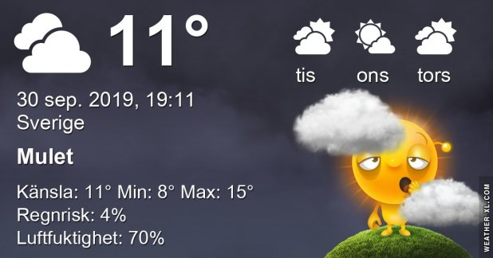

## Måndag 30 September

I dag gryr dagen i Asarum 06:24. Solen går upp klockan 07:01 och ner klockan 18:39 . Det mörknar vid 19:16. Dagens längd är 11 timmar och 38 minuter. Det är dagsljus 12 timmar och 52 minuter. Månen går upp 09:00 och ned 19:41 Månen är belyst 2 %

I Asarum blir dagen 4 minuter och 41 sekunder kortare. Dagen har blivit 6 timmar och 1 minuter kortare sedan sommarsolståndet. Vintersolstånd om 83 dagar.

Missa inte gyllene timmen som börjar klockan 17:52 i Asarum. Då står solen lågt och kastar ett fint gyllene ljus

 Molnigt 11,1 C  Vindstilla  Luftfuktighet 98 %  hPa 985 Kl.01:55

 Lätt regn 11,7 C  Vindstilla  Luftfuktighet 98 %  hPa 983  Regn 2 mm Kl.07:05

 Mest molnigt 18,1 C  Vindby 2,8 m/s S  Luftfuktighet 68 %  hPa 987  Regn 3,2 mm Kl.14:50

 Molnigt 8,8 C  Vindby 3,4 m/s SE  Luftfuktighet 71 %  hPa 991

Det började med dimma och regn och sen tittade solen fram. Och efter det började det blåsa.

Högst och lägst uppmätta temperatur igår (inofficiellt privat mätare) Max 18,7, Min 10,7 C Högst uppmätta vind 3,4 m/s, Högst uppmätta vindby 5,4 m/s

Högst och lägst uppmätta temperatur igår (officiellt enligt [YR.NO](http://www.vackertvader.se/v%C3%A4derstation/karlshamn?utm_source=email&utm_medium=email&utm_campaign=asarum)) Max 16 C, Min 10,6 C Högst uppmätta vind 2,3 m/s. Högst uppmätta vindby 6,3 m/s

## _**Diverse roligt**_

\[gallery type="rectangular" link="file" size="large" ids="32190,32191,32192,32193,32194,32195,32196,32197,32198"\]
