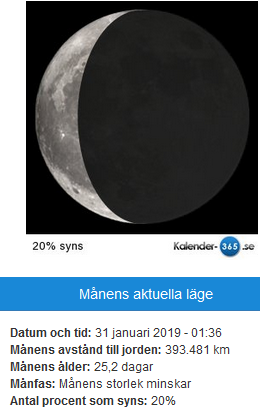
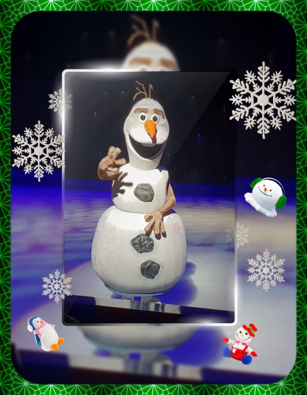

Idag går solen upp 07:59 och ned 16:30 Dagens längd är 8 timmar och 31 minuter. Det är gryning 07:17 och skymning 17:12 Det är dagsljus 9 timmar och 55 minuter. Månen går upp 04:53 och ned 12:32 Månen är belyst 20 %.

 Växlande molnighet - 1,8 C  Vindby 2 m/s E  Luftfuktighet 82 %  hPa 1001 Kl.01:35

Molnigt - 0,3 C  Vindby 3,4 m/s NW  Luftfuktighet 75 %  hPa 1000 Kl.07:45

 Molnigt 1,8 C  Vindby 1,4 m/s NW  Luftfuktighet 84 %  hPa 1000 Kl.14:30

 Molnigt - 0,8 C  Vindby 0,3 m/s W  Luftfuktighet 82 %  hPa 1000 Kl.20:05

Usch vad jag är trött på snön/isen som gör småvägarna glashala överallt.

Högst och lägst uppmätta temperatur igår (inofficiellt privat mätare) Max 5,9 C , Min – 4,7 C Högst uppmätta vind 1,7 m/s, Högst uppmätta vindby 3,6 m/s

Högst och lägst uppmätta temperatur igår (officiellt enligt [YR.NO](http://www.vackertvader.se/v%C3%A4derstation/karlshamn?utm_source=email&utm_medium=email&utm_campaign=asarum)) Max 1,8 C, Min – 4,9 C Högst uppmätta vind 1,7 m/s. Högst uppmätta vindby 5,3 m/s

 I brist på energi, inspiration och allt annat man skulle behöva massor av just nu så blir det bara lite bildlek idag.
