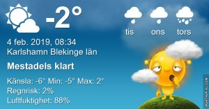

Idag går solen upp 07:51 och ned 16:39 Dagens längd är 8 timmar och 48 minuter. Det är gryning 07:10 och skymning 17:20 Det är dagsljus 10 timmar och 10 minuter. Månen går upp 08:00 och ned 16:03 Månen är belyst 1 %.

 Molnigt - 4,1 C  Vindby 0,3 m/s W  Luftfuktighet 78 %  hPa 1016 Kl.02:15

 Molnigt - 4,4 C  Vindby 0,7 m/s SE  Luftfuktighet 81 %  hPa 1017 Kl.06:40

 Molnigt 2,2 C  Vindby 0,3 m/s NE  Luftfuktighet 78 %  hPa 1017 Kl.14:00

 Molnigt 1 C  Vindby 3,6 m/s ENE  Luftfuktighet 76 %  hPa 1016 Kl.19:45

Nu är jag trött på snö och vinter

Högst och lägst uppmätta temperatur igår (inofficiellt privat mätare) Max 2,5 C , Min – 4,8 C Högst uppmätta vind 1,7 m/s, Högst uppmätta vindby 3,1 m/s

Högst och lägst uppmätta temperatur igår (officiellt enligt [YR.NO](http://www.vackertvader.se/v%C3%A4derstation/karlshamn?utm_source=email&utm_medium=email&utm_campaign=asarum)) Max 0,6 C, Min - 3,6 C Högst uppmätta vind 3,2 m/s. Högst uppmätta vindby 8,4 m/s

\[gallery type="rectangular" link="file" size="large" ids="27064,27065,27066,27067,27068,27069,27070"\]

I brist på inspiration och nya bilder så letade jag efter något i arkivet och det blev till slut dessa hus som jag fotade på Staten Island i somras. Det var en lite speciell stil på den ön och husen var av många olika stilar.
