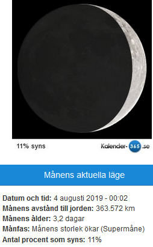

Idag går solen upp 07:49 och ned 16:41 Dagens längd är 8 timmar och 52 minuter. Det är gryning 07:08 och skymning 17:22 Det är dagsljus 10 timmar och 14 minuter. Månen går upp 08:26 och ned 17:10 Månen är belyst 0 %.

 Regn 0,5 C  Vindby 4,6 m/s NE  Luftfuktighet 85 %  hPa 1013  Regn 1 mm Kl.01:55

 

 Molnigt 1,4 C  Vindby 3,4 m/s NE  Luftfuktighet 84 %  hPa 1011  Regn 2,7 mm Kl.06:50

 Molnigt 5,5 C  Vindby 4,2 m/s NNE  Luftfuktighet 85 %  hPa 1010  Regn 3,2 mm Kl.14:20

 Växlande molnighet 0,5 C  Vindby 1,8 m/s ENE  Luftfuktighet 83 %  hPa 1014 Kl.21:10

 Idag har det töat hela dagen och mycket snö har smält bort, jippi!

Högst och lägst uppmätta temperatur igår (inofficiellt privat mätare) Max 2,8 C , Min – 4,1 C Högst uppmätta vind 3,4 m/s, Högst uppmätta vindby 5,4 m/s

Högst och lägst uppmätta temperatur igår (officiellt enligt [YR.NO](http://www.vackertvader.se/v%C3%A4derstation/karlshamn?utm_source=email&utm_medium=email&utm_campaign=asarum)) Max 2,3 C, Min – 5,1 C Högst uppmätta vind 3,4 m/s. Högst uppmätta vindby 9,2 m/s

\[gallery type="circle" link="file" size="large" ids="27080,27082"\]

Jag kände mig lite iakttagen inatt när jag jobbade. Vad ser ni här?
