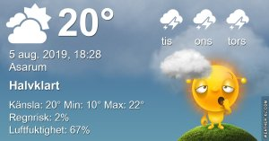

Idag går solen upp 05:10 och ned 21:01 Dagens längd är 15 timmar och 51 minuter. Det är gryning 04:23 och skymning 21:48 Det är dagsljus 17 timmar och 25 minuter. Månen går upp 11:00 och ned 22:59 Månen är belyst 21 %

 Molnigt 11,2 C  Vindby 0,3 m/s SW  Luftfuktighet 97 %  hPa 1008 Kl.02:10

 Slöjmoln 11,7 C  Vindstilla  Luftfuktighet 99 %  hPa 1007 Kl.06:45

 Mest tunna moln 28,4 C  Vindby 3,8 m/s E  Luftfuktighet 46 %  hPa 1006 Kl.12:55

 Tunna slöjmoln 19,1 C  Vindby 1,2 m/s SSE Luftfuktighet 73 %  hPa 1004 Kl.20:10

 

 Det som skulle bli så mycket regn blev bara 8 mm drygt. Suck! Idag har inte en droppe kommit!

 

Högst och lägst uppmätta temperatur igår (inofficiellt privat mätare) Max 32 ( i solen )  , Min 11,5 C Högst uppmätta vind 1,7 m/s, Högst uppmätta vindby 2,4 m/s

Högst och lägst uppmätta temperatur igår (officiellt enligt [YR.NO](http://www.vackertvader.se/v%C3%A4derstation/karlshamn?utm_source=email&utm_medium=email&utm_campaign=asarum)) Max 21,2 C, Min 11,5 C Högst uppmätta vind 2,9 m/s. Högst uppmätta vindby 5,6 m/s

 

## _**Morgonbilder utan djur... nästan i alla fall**_

Idag höll de sig undan bortsett från några fåglar. Men det blev rätt fina motiv ändå med dimma och soluppgång.

 

\[gallery type="rectangular" link="file" size="large" ids="30970,30971,30972,30973,30974,30975,30976,30977,30978,30979,30980,30981,30982,30983,30984"\]
