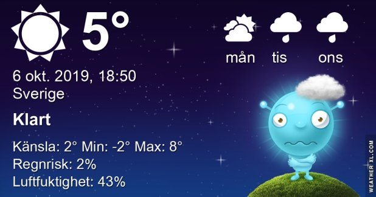

## Söndag 6 Oktober

I dag gryr dagen i Asarum 06:35. Solen går upp klockan 07:13 och ner klockan 18:24 . Det mörknar vid 19:01. Dagens längd är 11 timmar och 11 minuter. Det är dagsljus 12 timmar och 26 minuter. Månen går upp 16:16 och ned 23:22 Månen är belyst 52 %

I Asarum blir dagen 4 minuter och 35 sekunder kortare. Dagen har blivit 6 timmar och 29 minuter kortare sedan sommarsolståndet. Vintersolstånd om 77 dagar.

Missa inte gyllene timmen som börjar klockan 17:35 i Asarum. Då står solen lågt och kastar ett fint gyllene ljus

 Mest klart - 1,1 C  Vindby 0,4 m/s NE  Luftfuktighet 89 %  hPa 1020 KL.01:40

 Halvklart 0,7 C  Vindby 1,4 m/s S  Luftfuktighet 80 %  hPa 1020 Kl.07:15

 Halvklart 12,4 C  Vindby 2,7 m/s NW  Luftfuktighet 34 %  hPa 1018 Kl.13:40

 Halvklart - 1,8 C  Vindstilla  Luftfuktighet 75 %  hPa 1017 KL.20:10

Ännu en kall dag och en kall natt som väntar!

Högst och lägst uppmätta temperatur igår (inofficiellt privat mätare) Max 15,4, Min – 0,6 C Högst uppmätta vind 2,7 m/s, Högst uppmätta vindby 4,1 m/s

Högst och lägst uppmätta temperatur igår (officiellt enligt [YR.NO](http://www.vackertvader.se/v%C3%A4derstation/karlshamn?utm_source=email&utm_medium=email&utm_campaign=asarum)) Max 10 C, Min - 1,8 C Högst uppmätta vind 3,8 m/s. Högst uppmätta vindby 9,5 m/s

 

## _**Vet inte vad jag ska hitta på idag...**_

så det får bli lite knåp med bilder från Pinterest igen

\[gallery type="columns" link="file" size="large" ids="32296,32297,32298,32299"\]
