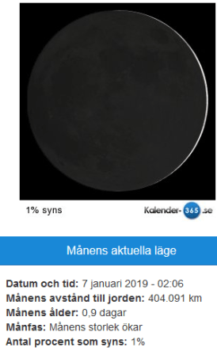

Idag går solen upp 08:31 och ned 15:43 Dagens längd är 7 timmar och 12 minuter. Det är gryning 07:44 och skymning 16:30 Det är dagsljus 8 timmar och 46 minuter. Månen går upp 09:26 och ned 17:07 Månen är belyst 1 %.

Molnigt 0,1 C  Vindby 0,7 m/s NW  Luftfuktighet 84 %  hPa 1021 Kl.02:10

Molnigt 1 C  Vindstilla  Luftfuktighet 86 %  hPa 1020 Kl.07:10

Molnigt 3,3 C  Vindby 2,4 m/s N  Luftfuktighet 89 %  hPa 1015 Kl.14:05

 Molnigt 2,3 C  Vindby 1,7 m/s S  Luftfuktighet 90 %  hPa 1007 Kl.19:55

 Tröttväder igen. Men åtminstone lite varmare.

Högst och lägst uppmätta temperatur igår (inofficiellt privat mätare) Max 2 C , Min – 8,1 C Högst uppmätta vind 0,7 m/s, Högst uppmätta vindby 1,4 m/s

Högst och lägst uppmätta temperatur igår (officiellt enligt [YR.NO](http://www.vackertvader.se/v%C3%A4derstation/karlshamn?utm_source=email&utm_medium=email&utm_campaign=asarum)) Max 0,9 C, Min – 8 C Högst uppmätta vind 2 m/s. Högst uppmätta vindby 4,1 m/s

\[gallery type="rectangular" link="file" size="large" ids="26370,26371,26372,26373,26374,26375" orderby="rand"\]

Vacker solnedgång vid hamnen i Funchal på Madeira
