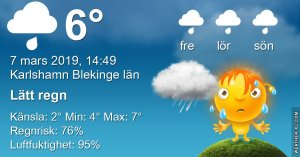
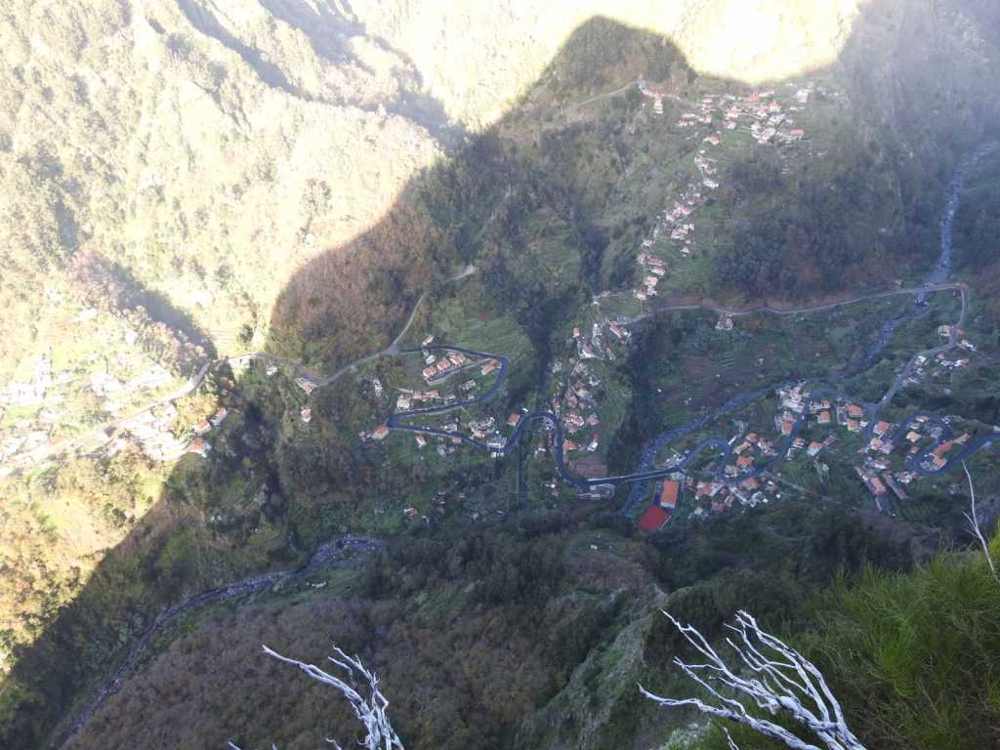
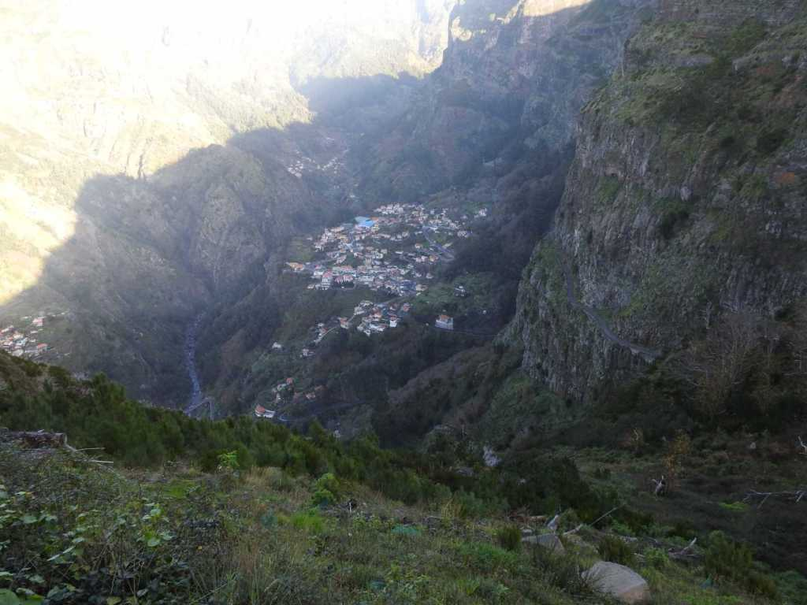
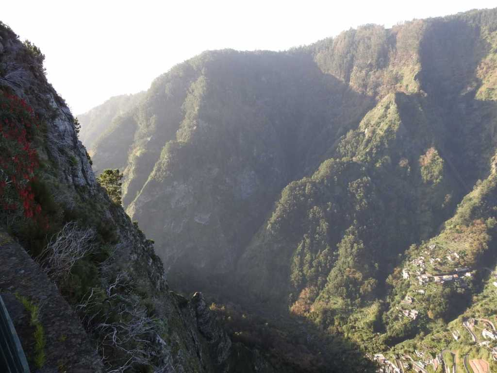
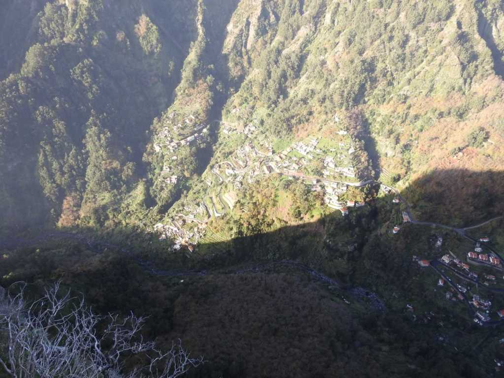
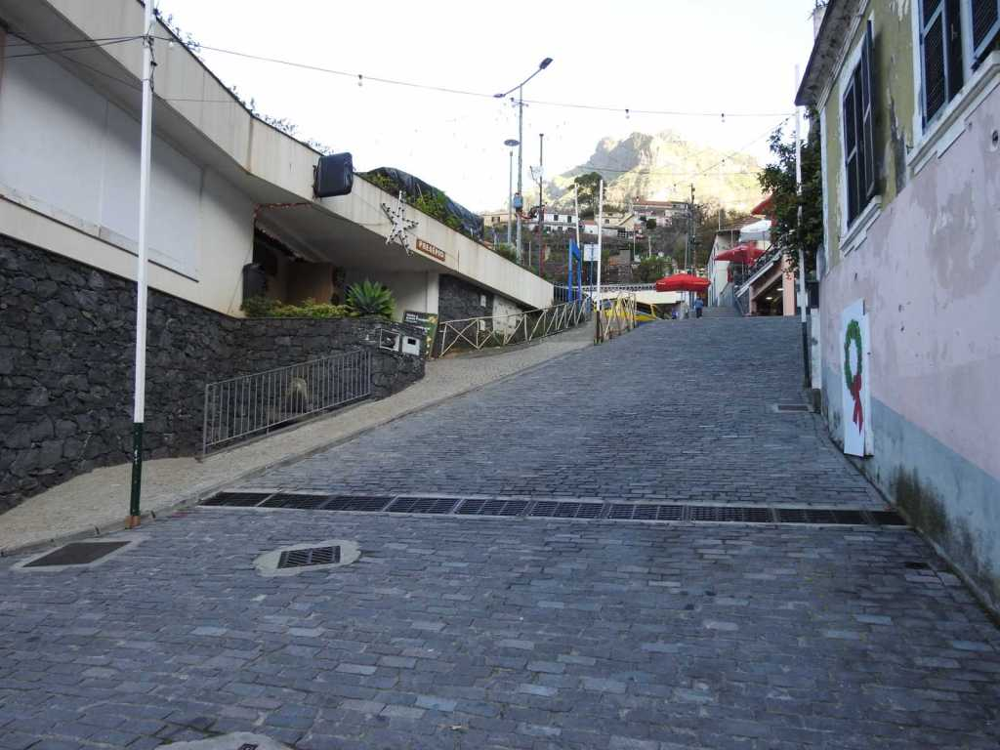
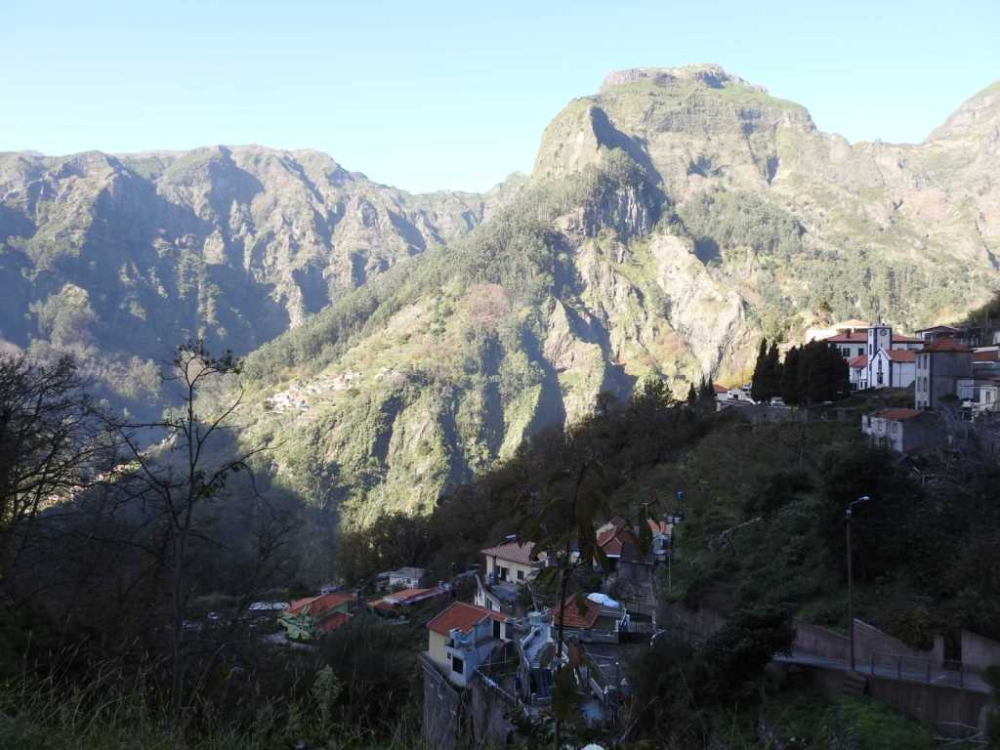

Idag går solen upp 06:38 och ned 17:46 Dagens längd är 11 timmar och 08 minuter. Det är gryning 06:01 och skymning 18:24 Det är dagsljus 12 timmar och 23 minuter. Månen går upp 07:28 och ned 18:27 Månen är belyst 0 %

 Regn 3,6 C  Vindby 4 m/s NNE  Luftfuktighet 95 %  hPa 993  Regn 1,7 mm Kl.01:40

 Regn och dis 4,6 C  Vindby 2,8 m/s N  Luftfuktighet 98 %  hPa 988  Regn 7,7 mm Kl.06:50

 Molnigt och en del regn 6,8 C  Vindby 1,4 m/s NE  Luftfuktighet 98 %  hPa 986  Regn 11,2 mm Kl.13:25

 Växlande molnighet 4,6 C  Vindby 3,6 m/s ESE  Luftfuktighet 74 %  hPa 988  Regn 11,2 mm Kl.19:55

 Regn och rusk och nu börjar det blåsa mer och mer.

Högst och lägst uppmätta temperatur igår (inofficiellt privat mätare) Max 6,2 , Min – 3,3 C Högst uppmätta vind 2,7 m/s, Högst uppmätta vindby 4,1 m/s

Högst och lägst uppmätta temperatur igår (officiellt enligt [YR.NO](http://www.vackertvader.se/v%C3%A4derstation/karlshamn?utm_source=email&utm_medium=email&utm_campaign=asarum)) Max 4,6 C, Min – 1,4 C Högst uppmätta vind 3,8 m/s. Högst uppmätta vindby 7,9 m/s

**Ett besök i Nunnornas dal på Madeira**

 Här tittar vi ner i dalen.

 En gång i tiden var det här den enda vägen ner till dalen. Numera är den av förklarliga skäl stängd och det finns en betydligt bättre väg dit.

 Det är helt vidunderligt att se ner i dalen från bergen ovanför.

 Tyvärr låg dalen i skugga när vi var där och det var riktigt kallt bland bergen.

 Dalen är omgiven av vackra majestätiska berg.

 Sista bilden från ovan. Nu beger vi oss ner till dalen.

 Här är vi nere i dalen. Det är inte så mycket att se här annat än några få gator med ganska slitna hus.
