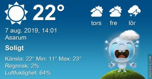

Idag går solen upp 05:14 och ned 20:57 Dagens längd är 15 timmar och 43 minuter. Det är gryning 04:28 och skymning 21:43 Det är dagsljus 17 timmar och 15 minuter. Månen går upp 13:48 och ned 23:34 Månen är belyst 42 %

 Mest molnigt 11,2 C  Vindby 0,3 m/s W  Luftfuktighet 98 %  hPa 1001 Kl.02:10

 Tunna moln 13,7 C  Vindstilla  Luftfuktighet 93 %  hPa 1001 Kl.07:15

 Växlande molnighet 27,8 C  Vindby 2,8 m/s S  Luftfuktighet 49 %  hPa 1001 Kl.13:30

 Växlande molnighet 18,7 C  Vindby 1,4 m/s NE  Luftfuktighet 66 %  hPa 1000 Kl.19:50

Det vill inte komma mer än några få droppar regn!

Högst och lägst uppmätta temperatur igår (inofficiellt privat mätare) Max 29,7 ( i solen )  , Min 12 C Högst uppmätta vind 2,7 m/s, Högst uppmätta vindby 4,4 m/s

Högst och lägst uppmätta temperatur igår (officiellt enligt [YR.NO](http://www.vackertvader.se/v%C3%A4derstation/karlshamn?utm_source=email&utm_medium=email&utm_campaign=asarum)) Max 21,7 C, Min 11,9 C Högst uppmätta vind 3,9 m/s. Högst uppmätta vindby 11,3 m/s

 

## _**Tänt var det här!**_

Jag såg den här jättestora tändsticksasken i Ronneby idag. Ingen tanke på eldningsförbud här inte hahaha.

