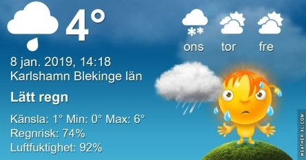

Idag går solen upp 08:30 och ned 15:45 Dagens längd är 7 timmar och 15 minuter. Det är gryning 07:44 och skymning 16:31 Det är dagsljus 8 timmar och 47 minuter. Månen går upp 09:56 och ned 18:12 Månen är belyst 4 %.

 Molnigt och lätt regn 5 C  Vindby 2,4 m/s E  Luftfuktighet 92 %  hPa 995  Regn 0,5 mm Kl.02:10

Duggregn 4,3 C  Vindby 1,2 m/s W  Luftfuktighet 91 %  hPa 989  Regn 1 mm Kl.06:50

Molnigt 6,9 C  Vindby 0,3 m/s NW  Luftfuktighet 88 %  hPa 987  Regn 2,2 mm Kl.13:55

 Lätt regn 2,4 C  Vindby 4,1 m/s SW  Luftfuktighet 88 %  hpa 992  Regn 4 mm Kl.21:00

 Blött. grått och varmt. Men nu ska det bli kallare igen. En evig rundgång med varmt och kallt om vartannat!

Högst och lägst uppmätta temperatur igår (inofficiellt privat mätare) Max 5,1 C , Min 0 C Högst uppmätta vind 3,1 m/s, Högst uppmätta vindby 5,1 m/s

Högst och lägst uppmätta temperatur igår (officiellt enligt [YR.NO](http://www.vackertvader.se/v%C3%A4derstation/karlshamn?utm_source=email&utm_medium=email&utm_campaign=asarum)) Max 4,6 C, Min 0,6 C Högst uppmätta vind 3,1 m/s. Högst uppmätta vindby 8,7 m/s

\[gallery type="rectangular" link="file" size="large" ids="26385,26386,26388,26389,26390"\]

Tyckte det var dags för dessa kloka ord igen!
