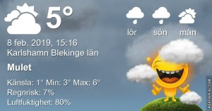

Idag går solen upp 07:43 och ned 16:48 Dagens längd är 9 timmar och 5 minuter. Det är gryning 07:03 och skymning 17:28 Det är dagsljus 10 timmar och 25 minuter. Månen går upp 09:20 och ned 20:36 Månen är belyst 9 %.

 Molnigt 3,8 C  Vindby 4 m/s NNE  Luftfuktighet 85 %   hPa 999 Kl.02:00

 Molnigt 4,3 C  Vindby 2,8 m/s ENE  Luftfuktighet 80 %  hPa 1000 Kl.07:35

 Molnigt 6,7 C  Vindby 4,2 m/s NNE  Luftfuktighet 70 %  hPa 1003 Kl.14:45

 Duggregn 3,4 C  Vindby 2,7 m/s NE  Luftfuktighet 84 %  hPa 1002 Kl.19:55

 Nu är det mesta av snön borta! Håller tummarna för att det inte kommer mer.

Högst och lägst uppmätta temperatur igår (inofficiellt privat mätare) Max 3,9 C , Min 2,3 C Högst uppmätta vind 1,7 m/s, Högst uppmätta vindby 3,4 m/s

Högst och lägst uppmätta temperatur igår (officiellt enligt [YR.NO](http://www.vackertvader.se/v%C3%A4derstation/karlshamn?utm_source=email&utm_medium=email&utm_campaign=asarum)) Max 3,1 C, Min 1,3 C Högst uppmätta vind 2,9 m/s. Högst uppmätta vindby 7,2 m/s

\[gallery type="rectangular" link="file" size="large" ids="27148,27149,27150,27151,27152,27153,27154,27155,27156,27157,27158,27159,27160" orderby="rand"\]

Tänkvärda citat
