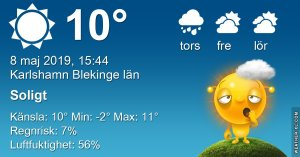

Idag går solen upp 05:02 och ned 20:54 Dagens längd är 15 timmar och 52 minuter. Det är gryning 04:14 och skymning 21:42 Det är dagsljus 17 timmar och 28 minuter. Månen går upp 06:46 och ned 23:51 Månen är belyst 10 %

 Mest klart - 1 C  Vindby 0,3 m/s W  Luftfuktighet 88 %  hPa 1009 Kl.01:30

 Molnigt 0,3 C  Vindstilla  Luftfuktighet 96 %  hPa 1009 Kl.06:40

 Halvklart 17,9 C  Vind3,6 m/s SE  Luftfuktighet 47 %  hPa 1007 Kl.14:30

 Molnigt 9 C  Vindby 3 m/s ENE  Luftfuktighet 47 %  hPa 1003 Kl.19:45

 Ännu en frysnatt! Jag är så heligt less på det nu!

Högst och lägst uppmätta temperatur igår (inofficiellt privat mätare) Max 15,6 ( i solen ) , Min - 0,4 C Högst uppmätta vind 5,8 m/s, Högst uppmätta vindby 9,9 m/s

Högst och lägst uppmätta temperatur igår (officiellt enligt [YR.NO](http://www.vackertvader.se/v%C3%A4derstation/karlshamn?utm_source=email&utm_medium=email&utm_campaign=asarum)) Max 11,8 C, Min - 0,2 C Högst uppmätta vind 4,3 m/s. Högst uppmätta vindby 12,5 m/s

\[gallery type="circle" link="file" size="large" ids="28456,28457,28458,28459,28468,28467"\]

Den här lilla fågeln såg vi i ett träd när vi var ute och gick en dag. Den var ungefär i storlek som en kungsfågel, väldigt liten och for runt lika snabbt som kungsfåglar ofta gör. Jag har dock ingen aning om vad det är för fågel tyvärr.

\[gallery type="rectangular" link="file" size="large" ids="28460,28461,28462,28463,28464,28465,28466"\]

En snabb runda på Walk of Fame och sedan tillbringade vi dagen på Universal Studios. Det kommer mer bilder därifrån imorgon.
