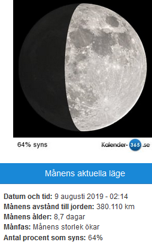

Idag går solen upp 04:59 och ned 20:56 Dagens längd är 15 timmar och 57 minuter. Det är gryning 04:12 och skymning 21:44 Det är dagsljus 17 timmar och 32 minuter. Månen går upp 08:23 och ned 00:42 Månen är belyst 18 %

 Molnigt 7,1 C  Vindby 3,6 m/s E  Luftfuktighet 74 %  hPa 1004 Kl.02:20

 Molnigt 7,3 C  Vindby 5 m/s E  Luftfuktighet 80 %  hPa 997 Kl.07:30

 Regn 8,9 C  Vindby 2,6 m/s NE  Luftfuktighet 98 %  hPa 998  Regn 8,2 mm Kl.14:35

 Molnigt och lite duggregn 7,8 C  Vindby 1,4 m/s E  Luftfuktighet 99 %  hPa 999  Regn 20,5 mm Kl.20:00

 Äntligen kom det regn i lite större mängder!

Högst och lägst uppmätta temperatur igår (inofficiellt privat mätare) Max 21,5 ( i solen ) , Min – 3,1 C Högst uppmätta vind 4,8 m/s, Högst uppmätta vindby 7,1 m/s

Högst och lägst uppmätta temperatur igår (officiellt enligt [YR.NO](http://www.vackertvader.se/v%C3%A4derstation/karlshamn?utm_source=email&utm_medium=email&utm_campaign=asarum)) Max 11,8 C, Min – 3,1 C Högst uppmätta vind 5,3 m/s. Högst uppmätta vindby 10,1 m/s

\[gallery type="rectangular" link="file" size="large" ids="28501,28502,28503,28504,28505,28506"\]

Idag fortsätter vår dag på Universal studios i Hollywood med ett besök både i temaparken och det riktiga Universal med alla inspelningsstudior och kulisser och rekvisita.

\[gallery link="file" size="large" type="rectangular" ids="28480,28481,28482,28483,28484,28485,28486,28487,28488,28489,28490,28491,28492,28493,28494,28495,28496,28497,28498,28499,28500"\]

Här åker vi på en rundtur bland alla stuios och kulisser där filmerna spelas in på riktigt.
