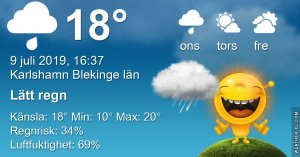

Idag går solen upp 04:26 och ned 21:45 Dagens längd är 17 timmar och 19 minuter. Det är gryning 03:26 och skymning 22:44 Det är dagsljus 19 timmar och 18 minuter. Månen går upp 13:16 och ned 00:36 Månen är belyst 44 %

 Molnigt 10,4 C  Vindby 0,7 m/s SW  Luftfuktighet 80 %  hPa 1006 Kl.02:00

 Mest molnigt 13,6 C  Vindby 1,4 m/s SE  Luftfuktighet 81 %  hPa 1006 Kl.07:10

 Mest molnigt 26,3 C  Vindby 2,8 m/s E  Luftfuktighet 53 %  hPa 1007 Kl.13:30

 Molnigt 13,6 C  Vindby 1 m/s E  Luftfuktighet 89 %  hPa 1009  Regn 4 mm Kl.20:25

 

 Idag fick vi ytterligare några droppar regn!

Högst och lägst uppmätta temperatur igår (inofficiellt privat mätare) Max 28,3 ( i solen )  , Min 9,1 C Högst uppmätta vind 2,4 m/s, Högst uppmätta vindby 5,1 m/s

Högst och lägst uppmätta temperatur igår (officiellt enligt [YR.NO](http://www.vackertvader.se/v%C3%A4derstation/karlshamn?utm_source=email&utm_medium=email&utm_campaign=asarum)) Max 21,7 C, Min 10,6 C Högst uppmätta vind 3,4 m/s. Högst uppmätta vindby 13,7 m/s

 

## _**Beatles museet i Liverpool**_

Här är några bilder från The Beatles story museum i Liverpool

\[gallery type="rectangular" link="file" size="large" ids="30338,30339,30340,30341,30342,30343,30344,30345,30346,30347,30348,30349,30350,30351,30352,30353,30354,30355,30356,30357,30358,30359,30360,30361,30362,30363,30364,30365,30366,30367,30368,30369,30371,30372,30373,30374,30375,30376,30377,30378,30379,30380"\]

## _**John Lennons barndomshem**_

Här är några bilder från huset där John Lennon växte upp.

 

\[gallery type="rectangular" link="file" size="large" ids="30382,30381,30383,30384"\]
