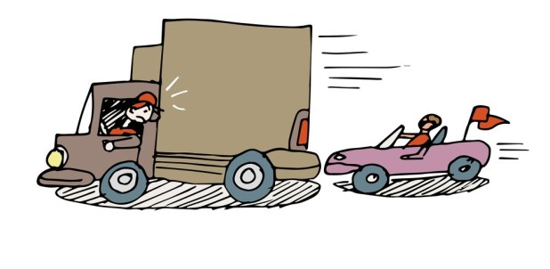

## _**Det här verkar vara omöjligt för många bilister att lära sig!**_

I den [här](https://www.expressen.se/motor/10-regler-svenska-bilister-vagrar-lara-sig/?utm_campaign=aob-newsletter-2019v45&utm_source=expressen-aob-email&utm_medium=email&utm_content=link&utm_term=) artikeln kan du läsa om de tio svåraste sakerna för svenska bilister! Varför är det så svårt att lära sig de här enkla sakerna som skulle göra trafiken så mycket säkrare för alla som vistas på vägarna. Det är ju inget som kräver särskilt mycket av bilisten och ändå verkar de flesta ha väldigt svårt för flera av dessa saker! Själv blir jag mest irriterad över nummer 3,4,6,9 och 10.

