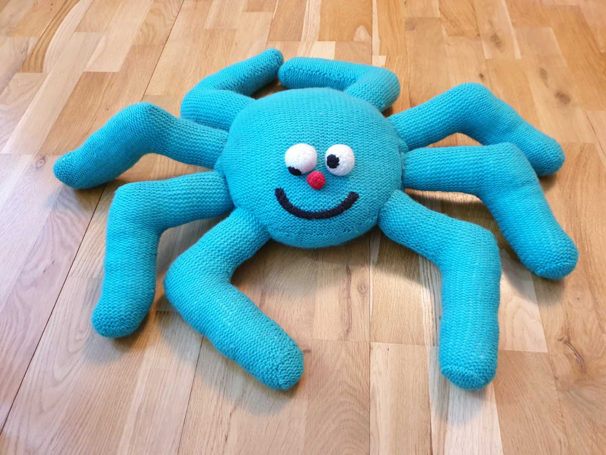
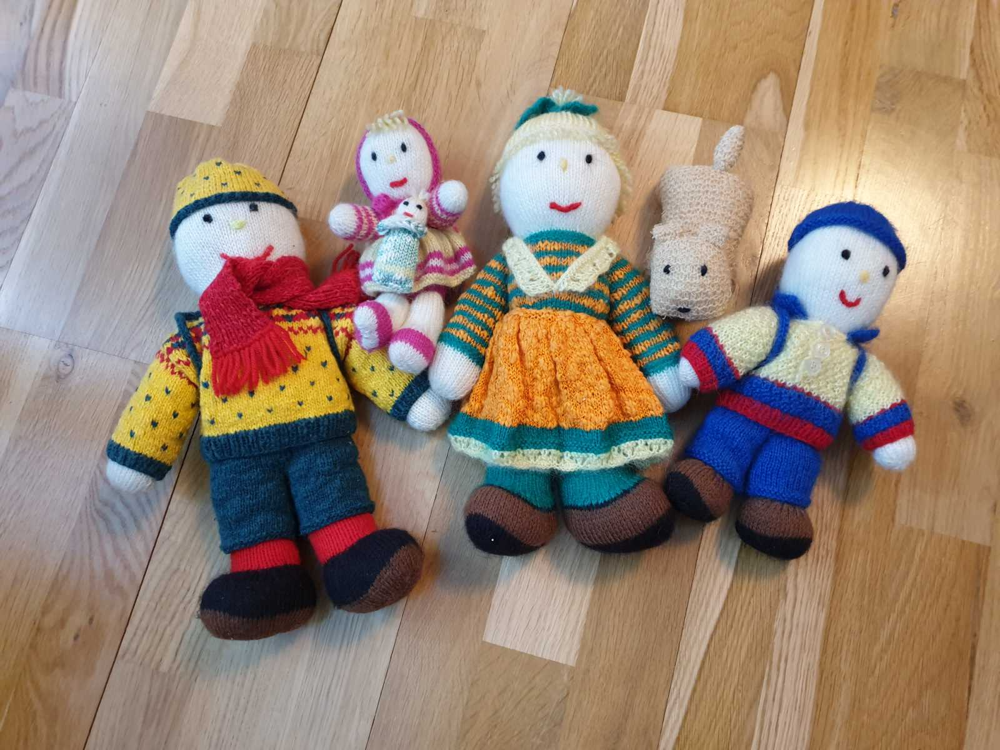
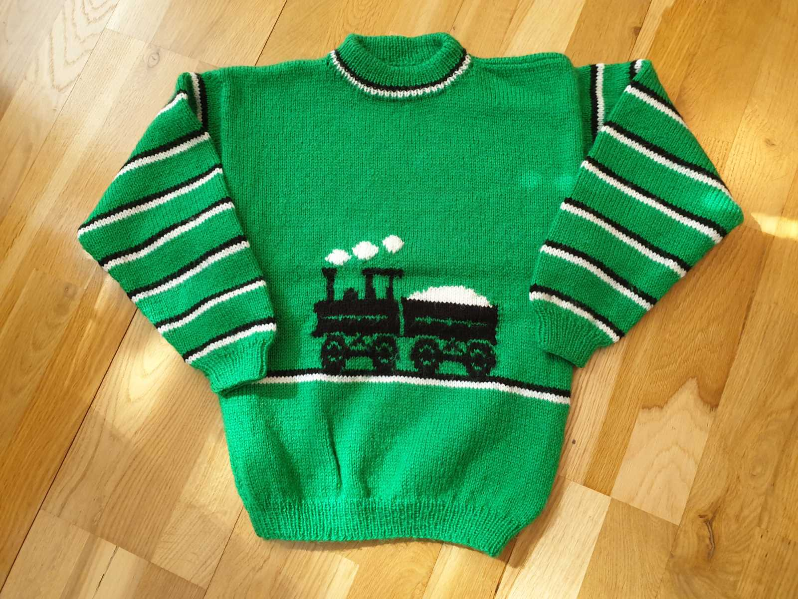

## _**När jag var som mest stickgalen...**_

så stickade jag allt mellan himmel och jord! Här är lite av det jag har stickat under årens gång. Jag sålde även mjukisdjur och dockor på beställning och katterna som ni ser här har jag stickat och sålt i hundratal i olika färger och storlekar. En sådan katt stickade jag på ett par tre kvällar när jag var som mest aktiv. Ibland saknar jag den tiden!

 Min blåa elefant!

 Herr Giraff!

 Fru Snögumma och herr Kisse! Och den virkade mr Giraff!

 Trots min spindelfobi så knåpade jag ihop fröken Snurrig!

 Den toviga och luggslitna katten till höger är den allra första jag gjorde! Sedan följde det hundratals i hans fotspår!

 Min första dockfamilj!

 Sen följde det fler i deras fotspår!

 Farbror Tusenfoting tog ett tag att göra med alla fötter! Men även han fick några kompisar med tiden!

 Och sist men inte minst, Johannes tågtröja! Han älskade ånglok när han var liten, så vad passade bättre än en tröja med ånglok då!
