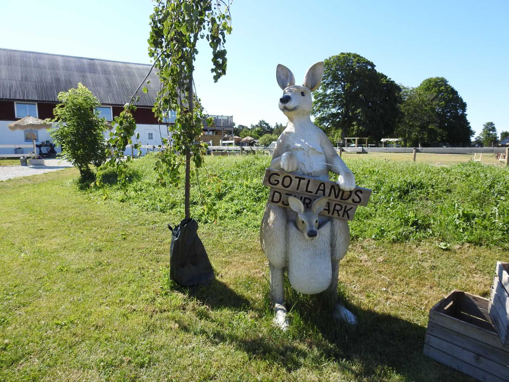

## _**Dag 4 del 1**_

**_Gotlands djurpark_**

 Gotlands djurpark är en ganska liten djurpark som mer liknar en 4 H gård än en vanlig djurpark. Djuren har det bra här och får gå fritt i en härlig miljö. Många av den vandrade runt i en stor skog och det var riktigt mysigt att gå runt bland dem och bara njuta av lugnet och doften av natur!

\[gallery type="rectangular" link="file" size="large" ids="37957,37958,37930"\]

\[gallery type="rectangular" link="file" size="large" ids="37931,37939,37940,37955,37956,37964"\]

\[gallery type="rectangular" link="file" size="large" ids="37968,37966,37971,37970,37969"\]

\[gallery type="rectangular" link="file" size="large" ids="37934,37933"\]

\[gallery type="rectangular" link="file" size="large" ids="37962,37961,37960,37959"\]

\[gallery type="rectangular" link="file" size="large" ids="37937,37938,37942,37943,37945,37946,37947,37948,37944,37949"\]

\[gallery type="rectangular" link="file" size="large" ids="37932,37941,37953,37950,37973,37972,37936,37935"\]

\[gallery type="rectangular" link="file" size="large" ids="37967,37963"\]

 En härlig miljö att strosa runt i!

\[gallery type="circle" link="file" size="large" ids="37952,37951"\]

En och annan skum figur stötte vi på i skogen!

I del två av dag 4 hälsar vi på Pippi Långstrump i Villa Villekulla! Det kommer i nästa inlägg!
