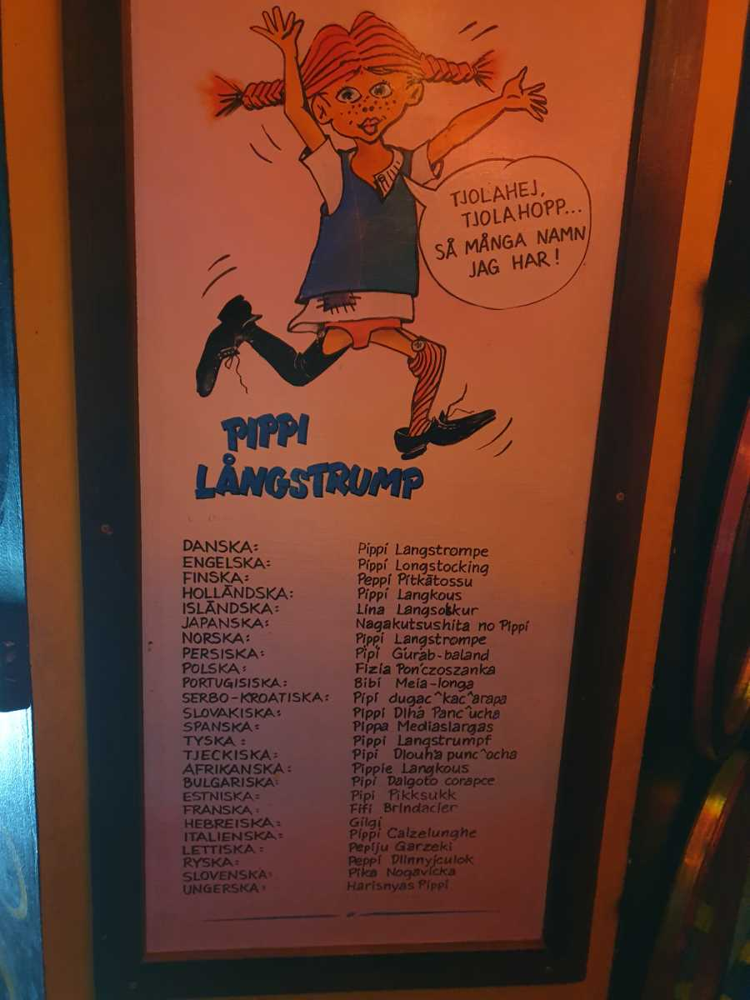

## _**Dag 4 del 2**_

_**Villa Villekulla**_

\[gallery type="rectangular" link="file" size="large" ids="38313,38312,38311,38310,38309,38301,38295,38293,38292,38291,38290,38289,38288,38287,38265"\]

Först lite bilder från utsidan av VillaVillekulla. Det här är det hus där filmerna med Pippi faktiskt spelades in till skillnad från kopian som finns i Vimmerby där Astrid Lindgrens värld finns.

\[gallery type="rectangular" link="file" size="large" ids="38298,38297,38296,38286,38285,38278,38277,38276,38275,38274,38273,38272,38271,38270,38269,38268,38267,38266"\]

Och sen lite bilder från insidan med allt man minns från serien och filmerna. När man kom in spelades en ljudfilm upp som var från serien och som avslutades med Pippisången. Jag ska se om det går att lägga upp den på Youtube utan att copyrightnissarna tar bort den på grund av sången!

\[gallery link="file" size="large" type="rectangular" ids="38283,38282,38281,38280,38279"\]

Här har vi tagit oss upp på den kusliga vinden med alla sjörövare och andra otäcka figurer som smög på oss!

 Pippi på alla möjliga och omöjliga språk!

\[gallery type="rectangular" link="file" size="large" ids="38303,38304"\]

\[gallery type="rectangular" link="file" size="large" ids="38306,38305"\]

\[gallery type="rectangular" link="file" size="large" ids="38307,38308"\]

 Sen kom vi till en lite annorlunda "utställning"
