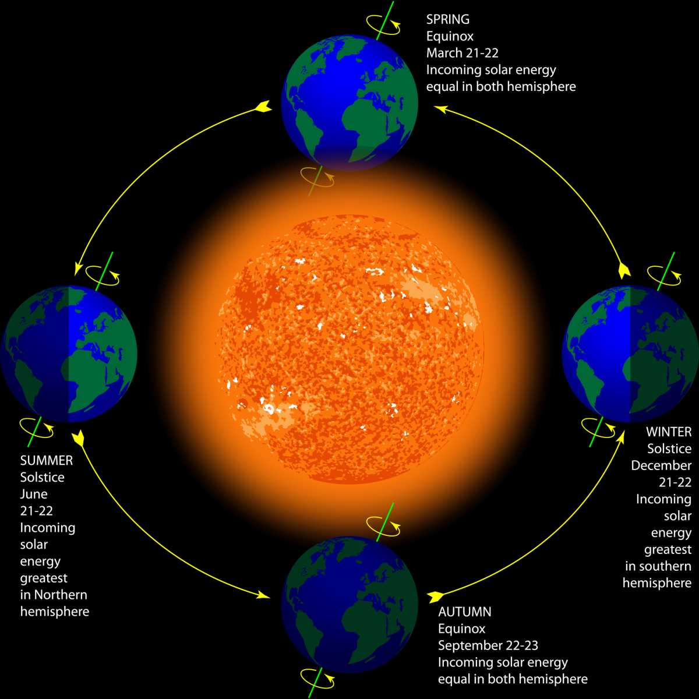

## _**Idag är det höstdagjämning**_

Det betyder att dag och natt är ungefär lika långa.

Vill du läsa mer om höstdagjämningen kan du göra det [här](https://sv.wikipedia.org/wiki/H%C3%B6stdagj%C3%A4mningen)

[Här](https://www.smhi.se/kunskapsbanken/meteorologi/hostdagjamning-och-vardagjamning-1.4185) kan du läsa vad SMHI skriver om höst och vårdagjämningen.

\[caption id="attachment\_37369" align="aligncenter" width="1200"\]  \[/caption\]
