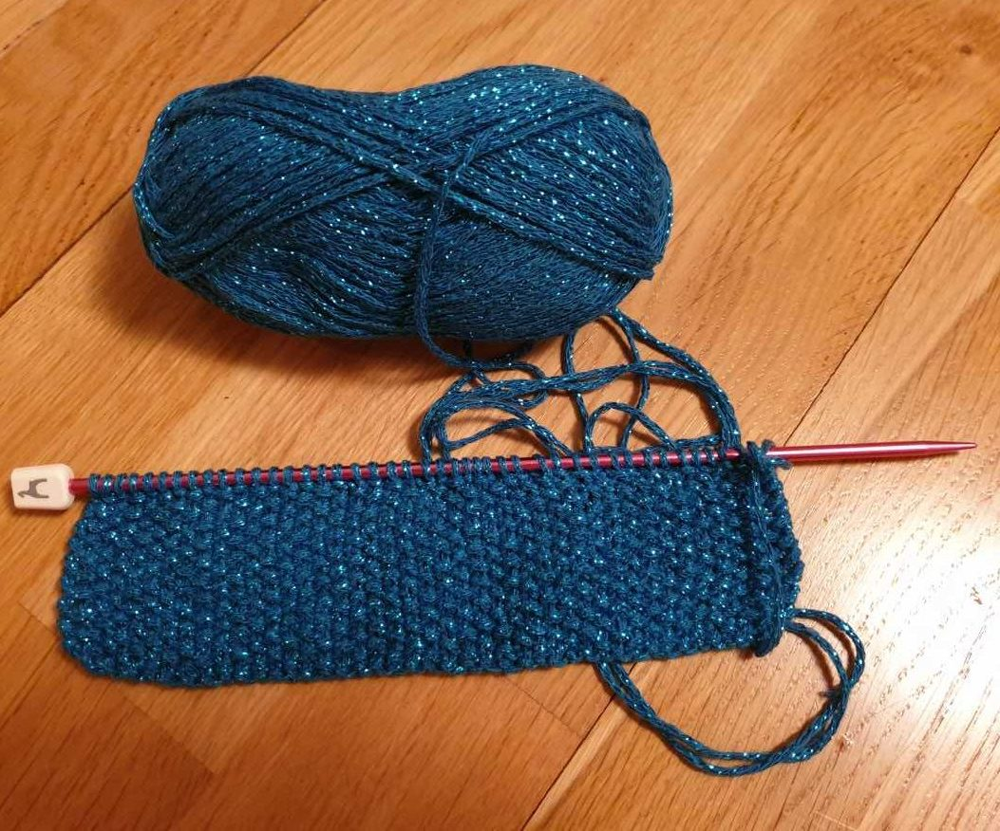
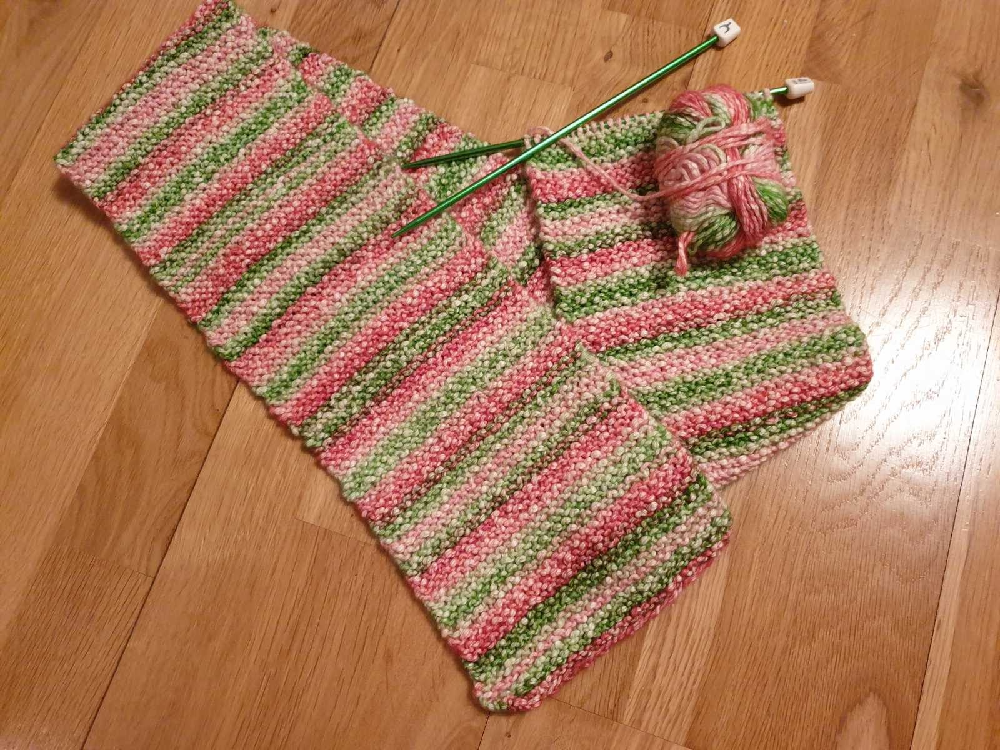
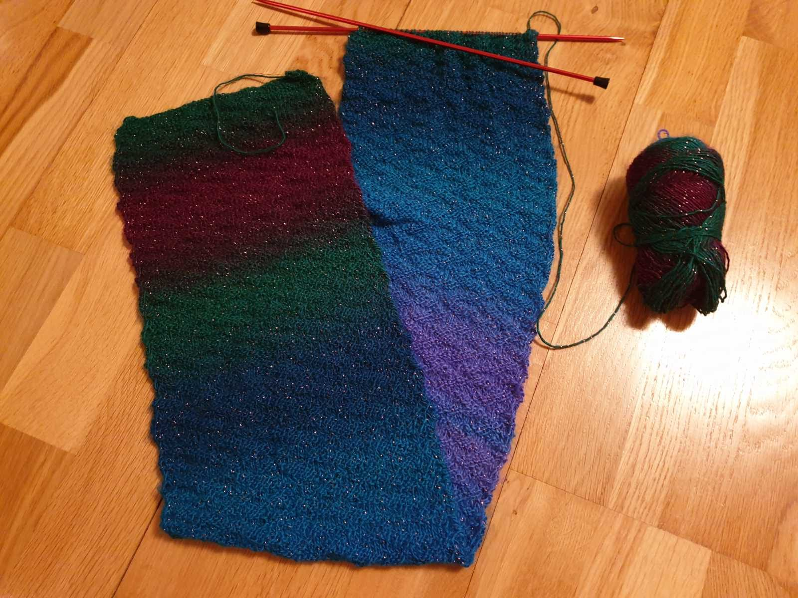
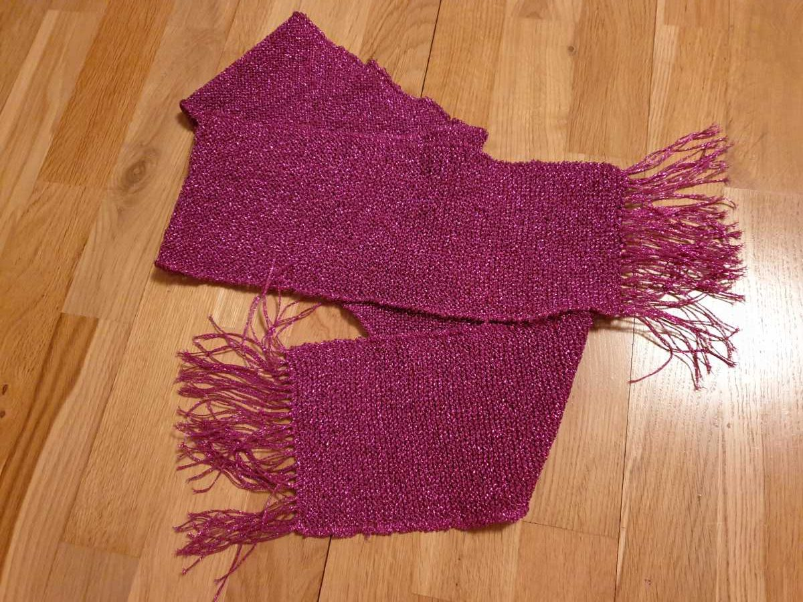
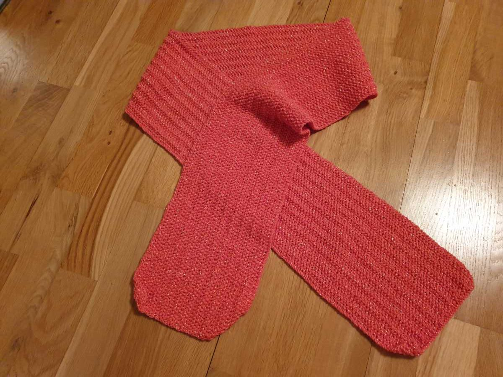
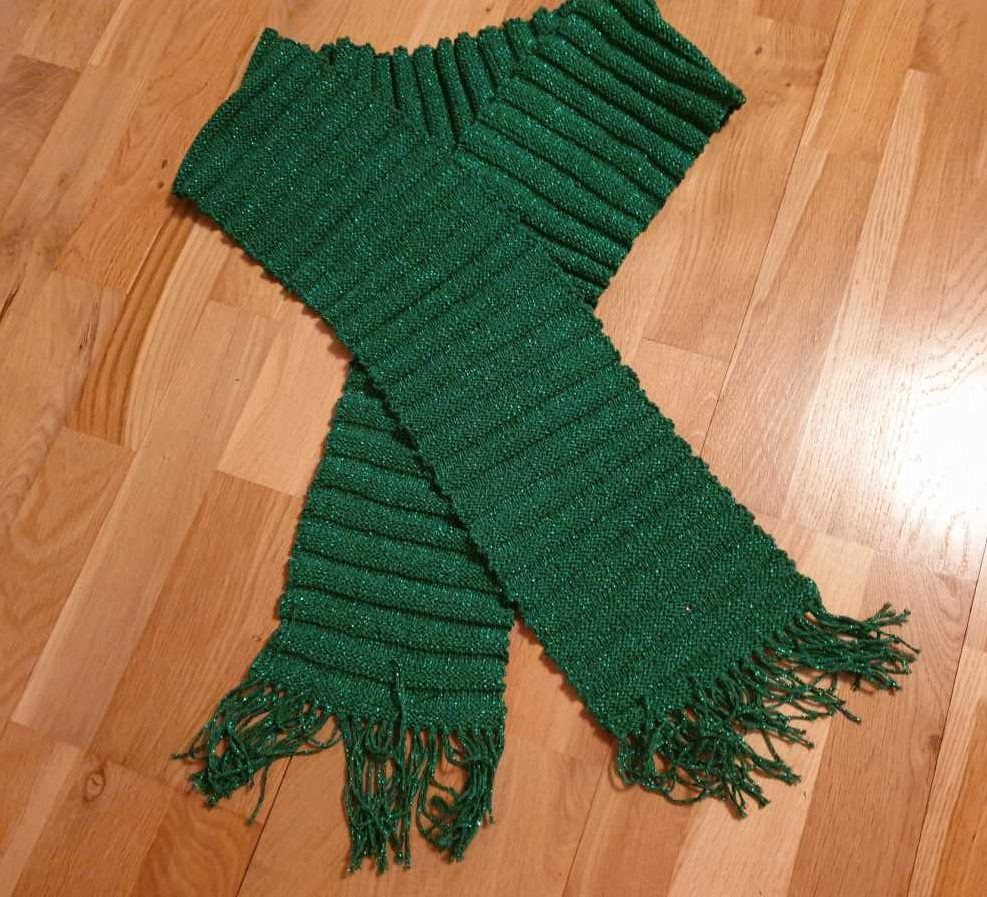

## _**Efter många års uppehåll ...**_

så har jag börjat sticka igen. Och eftersom jag inte använder stickade tröjor särskilt mycket så har det fått bli sjalar och halsdukar istället. Dessutom älskar jag färger och glitter! Så många glada färger och mycket glitter blir det! Här är några av mina färdiga och pågående projekt.

