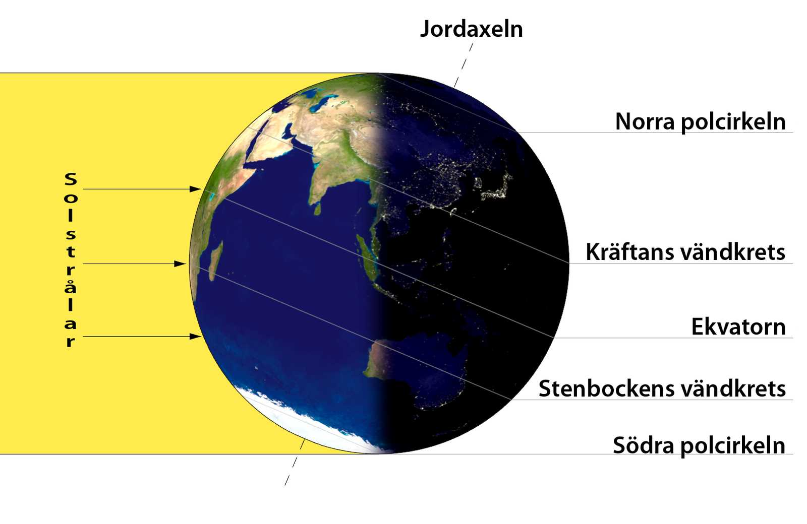

## _**Äntligen!**_

Äntligen går vi mot ljusare tider igen! Imorgon, den 21/12 är det vintersolstånd och sedan vänder det sakta men säkert mot ljusare och trevligare tider igen!

[Här](https://sv.wikipedia.org/wiki/Vintersolst%C3%A5ndet) på Wikipedia kan du läsa allt om vintersolståndet. Och [här](https://www.smhi.se/kunskapsbanken/meteorologi/solens-upp-och-nedgang/sommarsolstand-och-vintersolstand-1.4180) på SMHI:s sida också.

SMHI har gjort en väldigt bra sida där man kan se hur vädret varit långt tillbaka. Man kan välja ort och specifika datum och mycket mer. Man kan se hur mycket varmare medeltemperaturen har blivit, högsta och lägsta årsmedeltemperatur osv. [Här](https://www.smhi.se/klimat/klimatet-da-och-nu/hur-var-vadret/q/Karlshamn) kan du se och välja vilken ort du vill titta tillbaka på.
