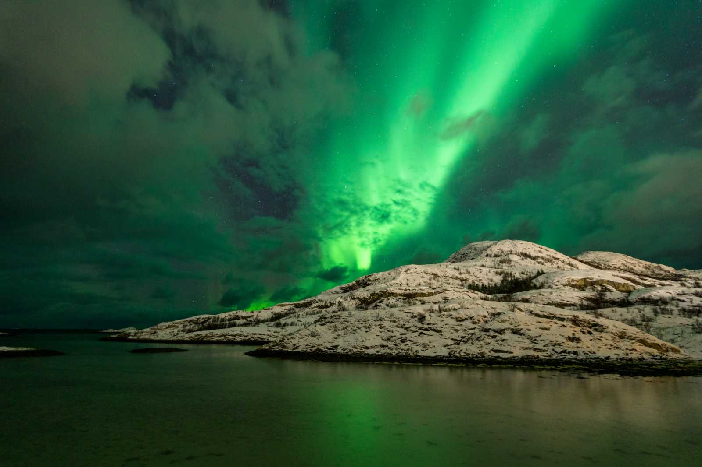

## **Vi har varit i Tromsö**

Vi tog en weekendresa till Tromsö i Norge i hopp om att få se lite norrsken. Det såg inte så hoppfullt ut eftersom det började snöa ordentligt när vi kom dit. Men när det var dags för norrskensturen så bestämde det sig för att klarna upp lite och vi fick se norrsken om än inte så sprakande som vi hade hoppats på. Här är lite blandade bilder från vår resa.

\[gallery type="rectangular" link="file" size="full" ids="47979,47980,47981,47982,47983,47984,47985,47986,47987,47988,47989,47990,47991,47993,47994,47995,47996,47997,47998,47999"\]

Först lite bilder från vår tur till Sommeroy där vi verkligen fick känna av att det var vinter. Mycket renar och vackra fjäll och fjordar fick vi se!

\[gallery type="rectangular" link="file" size="full" ids="48001,48002,48003,48004,48005,48006,48007,48008,48009"\]

Sen lite bilder från Tromsö som verkligen är en otroligt mysig liten stad med allt på gångavstånd. Massor av matställen och affärer och annat att utforska.

\[gallery type="rectangular" link="file" size="large" ids="48011,48012,48013"\]

Hurtigruten var på besök i hamnen. Den planerar vi att åka med i sommar.

Och till sist en bild på det eftertraktade norrskenet som vi fick se till slut. Tyvärr fick vi inga riktigt bra bilder själva så det här är en bild som vår guide tog åt oss. Visst är det vackert!
